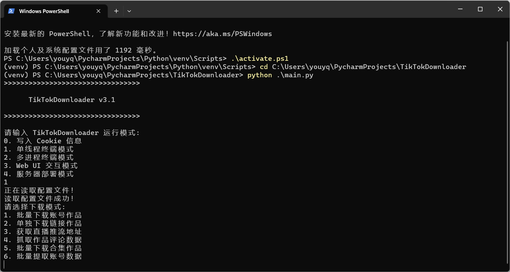
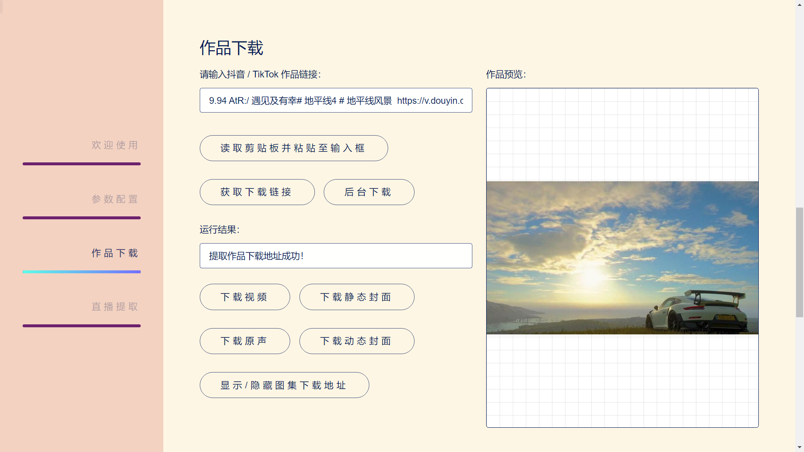

<div align="center">
<br>
<h1>TikTokDownloader</h1>
<a href="https://github.com/JoeanAmier/TikTokDownloader/blob/master/license">

</a>
<a href="https://github.com/JoeanAmier/TikTokDownloader/releases/latest">

</a>
<a href="https://github.com/JoeanAmier/TikTokDownloader/blob/master/docs/QQ%E7%BE%A4%E8%81%8A.jpg">

</a>
</div>
<br>
<p>🔥 <b>抖音视频/图集/直播/原声/合集/评论/账号数据采集工具: </b>完全开源，开箱即用，基于 Requests 模块实现；批量下载抖音账号发布页或者喜欢页的作品；单独下载抖音链接对应的作品；获取抖音直播推流地址；下载抖音直播视频；抓取作品评论数据；批量下载合集作品，采集账号详细数据。</p>
<p>⭐ <b>使用者在使用本项目的代码时，请遵守 <a href="https://github.com/JoeanAmier/TikTokDownloader/blob/master/license">GNU General Public License v3.0</a> 开源协议。</b></p>
<hr>

# 📝 功能清单

* ✅ 下载抖音无水印视频/图集
* ✅ 批量下载账号发布页/喜欢页作品
* ✅ 单独下载链接对应的作品
* ✅ 多账号批量下载作品
* ✅ 自动跳过已下载的文件
* ✅ 持久化保存采集数据
* ✅ 下载动态/静态封面图
* ✅ 获取直播推流地址
* ✅ 下载抖音直播视频
* ✅ Web UI 交互界面
* ✅ 抓取作品评论数据
* ✅ 批量下载合集作品
* ✅ 记录点赞收藏等统计数据
* ✅ 筛选作品发布时间
* ✅ 支持使用代理采集数据
* ✅ 支持局域网远程访问
* ✅ 采集账号详细数据
* ✅ 作品统计数据更新
* ✅ 自动更新账号昵称
* ✅ 直接部署至公开服务器
* ☑️ 支持 TikTok 平台
* ☑️ 批量下载账号收藏作品
* ☑️ 获取账号收藏合集列表

# 💻程序界面

* 单线程终端模式：
  

<hr>

* Web UI 交互模式：
  

# 📈 项目状态

* 🟢 [Releases](https://github.com/JoeanAmier/TikTokDownloader/releases/latest) 发布的源码已通过测试，功能均可正常使用
* 🟡 准备开发批量下载账号收藏作品功能
* 🟡 准备开发多进程模式，提高多账号批量下载效率
* 🔴 最新版本的源码可能存在不稳定的 Bug
* 🔴 如果在使用过程中发现 Bug，请及时告知作者修复

# 📁 项目结构

```text
TikTokDownloader
├─ main.py                                 // 项目程序启动入口
├─ requirements.txt                        // 程序所需第三方模块信息
├─ settings.json                           // 运行参数配置文件
├─ src                                     // 项目模块源码文件夹
│    ├─ CookieTool.py                      // Cookie 写入模块
│    ├─ Configuration.py                   // 配置文件处理模块
│    ├─ DataAcquirer.py                    // 抖音数据获取模块
│    ├─ DataDownloader.py                  // 作品文件下载模块
│    ├─ FileCache.json                     // 文件管理缓存数据
│    ├─ FileManager.py                     // 作品文件管理模块
│    ├─ Parameter.py                       // 加密参数生成模块
│    ├─ Recorder.py                        // 日志及数据记录模块
│    ├─ StringCleaner.py                   // 非法字符处理模块
│    ├─ main_complete.py                   // 单线程启动入口
│    ├─ main_multiprocess.py               // 多进程启动入口
│    ├─ main_server.py                     // 服务器启动入口
│    └─ main_web_UI.py                     // Web UI 启动入口
├─ static                                  // 静态资源文件夹
├─ templates                               // HTML 模板文件夹
└─ docs                                    // 项目文档文件夹
```

# 📋 使用说明

**使用方法:**

1. 下载最新的源代码或 [Releases](https://github.com/JoeanAmier/TikTokDownloader/releases/latest) 发布的源代码至本地
2. 安装 requirements.txt 包含的第三方模块
3. 运行 main.py 并选择`单线程终端模式`，生成默认配置文件
4. 阅读 README.md 了解项目介绍和配置文件规则
5. 打开抖音网页版，复制 Cookie 至配置文件\(可使用 main.py 写入\)
6. 根据下载需求修改 settings.json 配置文件
7. 再次运行 main.py 即可正常使用

<b>
更多项目说明可以查看&nbsp;<a href="https://github.com/JoeanAmier/TikTokDownloader/issues?q=is%3Aopen+is%3Aissue+label%3Adocumentation">issues</a>
</b>

<hr>

**程序运行模式:**

* 单线程终端模式: 支持所有功能
* 多进程终端模式\(未完成\): 仅支持多账号批量下载功能
* Web UI 交互模式: 仅支持单独下载功能和获取直播推流地址功能
* 服务器部署模式: 仅支持单独下载功能，可直接部署至公开服务器

<hr>

**Cookie:**

[点击查看 Cookie 获取教程](https://github.com/JoeanAmier/TikTokDownloader/blob/master/docs/Cookie%E6%95%99%E7%A8%8B.md)

|   程序功能    | 是否需要登录 |
|:---------:|:------:|
| 批量下载发布页作品 |   ❌    |
| 批量下载喜欢页作品 |   ❌    |
| 单独下载链接作品  |   ❌    |
| 提取直播推流地址  |   ❌    |
|  下载直播视频   |   ❌    |
| 获取作品评论数据  |   ❌    |
| 批量下载合集作品  |   ❌    |
|  获取账号数据   |   ❌    |

<hr>

**注意事项:**

* 批量下载账号作品时，每个账号的作品会下载至对应的 `账号标识` 文件夹
* 单独下载链接作品时，所有作品均下载至 `folder` 参数指定的文件夹
* 如果作品没有描述，保存时文件名称的描述内容将替换为作品 ID
* 程序功能异常时优先尝试更新 Cookie 至配置文件后重试
* 由于获取账号喜欢页数据仅返回喜欢作品的发布日期，不返回点赞日期，因此程序需要获取全部喜欢作品数据再进行日期筛选，如果账号喜欢页作品较多，可能会花费较长的时间
* 如果单独下载功能正常，批量下载功能异常，请尝试更新 Cookie 或者使用代理
* 直播推流地址可以复制到下载工具进行下载，也可以直接使用本项目的程序进行下载
* 使用 `SQLite` 格式储存数据时，重复获取作品数据将会更新点赞收藏等统计数据
* 批量下载合集作品时，只需要输入任何一个属于该合集的作品链接，程序会自动下载作品所属合集的全部作品
* 获取私密账号的发布页数据需要登录后的 Cookie，且登录的账号需要关注该私密账号
* 批量下载账号作品或合集作品时，如果对应的昵称或标识发生变化，程序会自动更新已下载作品文件名称中的昵称和标识
* 单独下载链接作品时，如果在 `name` 参数中设置了 `mark` ，程序会自动替换为 `nickname`
* 为保护访客隐私，`服务器部署模式` 禁用了日志记录和数据存储功能，不会记录任何作品提取数据
* `服务器部署模式` 基础功能已经完成，但在网页交互和用户体验方面仍有改进空间，需要进一步优化

# 🔗 链接类型

|                       链接格式                       |   链接内容   |  
|:------------------------------------------------:|:--------:|
|           `https://v.douyin.com/分享码/`            | 账号、视频、图集 |
|        `https://www.douyin.com/note/作品ID`        |    图集    |
|       `https://www.douyin.com/video/作品ID`        |    视频    |
|        `https://www.douyin.com/user/账号ID`        |    账号    |
| `https://www.douyin.com/user/账号ID?modal_id=作品ID` | 账号、视频、图集 |
|          `https://live.douyin.com/直播ID`          |    直播    |

# ⚙️ Settings.json

|                        参数                         |                   类型                    |                                                                   说明                                                                    |
|:-------------------------------------------------:|:---------------------------------------:|:---------------------------------------------------------------------------------------------------------------------------------------:|
|                       mark                        |                   str                   |                                               账号标识，设置为空字符串代表使用帐号昵称<br>**属于 accounts 子参数**                                               |
|                        url                        |                   str                   |                                            账号主页链接，批量下载时使用\(非视频/图集链接\)<br>**属于 accounts 子参数**                                            |
|                       mode                        |                   str                   |                                 批量下载类型，`post` 代表发布页，`favorite` 代表喜欢页<br>需要账号喜欢页公开可见，**属于 accounts 子参数**                                 |
|                     earliest                      |                   str                   |                                       作品最早发布日期，格式: `2023/1/1`，设置为空字符串代表不限制<br>**属于 accounts 子参数**                                       |
|                      latest                       |                   str                   |                                       作品最晚发布日期，格式: `2023/1/1`，设置为空字符串代表不限制<br>**属于 accounts 子参数**                                       |
| accounts<br>\[mark, url, mode, earliest, latest\] | list\[list\[str, str, str, str, str\]\] |                                    账号标识, 账号链接, 批量下载类型, 最早发布日期, 最晚发布日期；批量下载账号作品时使用，支持多账号，以列表格式包含五个参数                                     |
|                       root                        |                   str                   |                                                      作品文件和数据记录保存路径，默认值: 当前路径 `./`                                                       |
|                      folder                       |                   str                   |                                                   下载单独链接作品时，储存文件夹的名称，默认值: `Download`                                                    |
|                       name                        |                   str                   | 文件保存时的命名规则，值之间使用空格分隔<br>默认值: 发布时间-账号昵称-描述<br>`id`: 唯一值, `desc`: 描述, `create_time`: 发布时间<br>`nickname`: 账号昵称, `mark`: 账号标识, `uid`: 账号UID |
|                       time                        |                   str                   |                                      发布时间的格式，默认值: `年-月-日 时.分.秒`<br>注意: Windows 系统的文件名称不能包含英文冒号 `:`                                      |
|                       split                       |                   str                   |                                                            文件命名的分隔符，默认值: `-`                                                            |
|                       music                       |              list\[bool\]               |                                                          是否下载作品音乐，默认值: `False`                                                          |
|                       save                        |                   str                   |                                      采集数据持久化储存格式，设置为空字符串代表不保存<br>目前支持: `csv`、`xlsx`、`sql`(SQLite)                                       |
|                      cookie                       |               list\[str\]               |                                               抖音网页版 Cookie，必需参数<br>可以使用 `main.py` 写入配置文件                                                |
|                      dynamic                      |              list\[bool\]               |                                                         是否下载动态封面图，默认值: `False`                                                          |
|                     original                      |              list\[bool\]               |                                                         是否下载静态封面图，默认值: `False`                                                          |
|                      proxies                      |               list\[str\]               |                                                           代理地址，设置为空字符串代表不使用代理                                                           |
|                        log                        |                  bool                   |                                                          是否记录运行日志，默认值: `False`                                                          |
|                     download                      |              list\[bool\]               |                                                是否打开下载功能，如果关闭，程序将不会下载任何文件<br>默认值: `True`                                                 |
|                       retry                       |                   int                   |                                            发送请求获取数据发生异常时重试的最大次数<br>设置为 `0` 代表关闭重试，默认值: `10`                                             |

# 💡 代码参考

* https://github.com/Johnserf-Seed/TikTokDownload
* https://github.com/Evil0ctal/Douyin_TikTok_Download_API
* https://github.com/davidteather/TikTok-Api
* https://requests.readthedocs.io/en/latest/
* https://dormousehole.readthedocs.io/en/latest/
* https://github.com/B1gM8c/X-Bogus
* https://html5up.net/hyperspace
