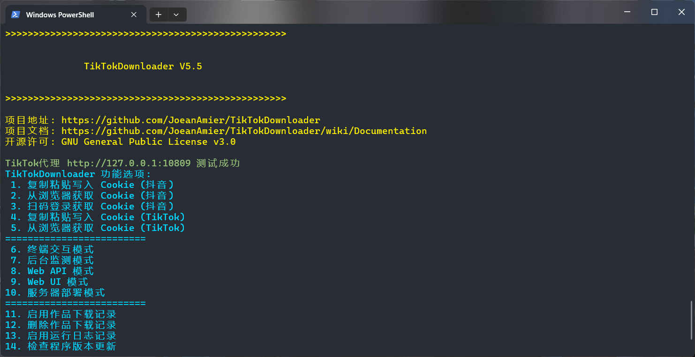
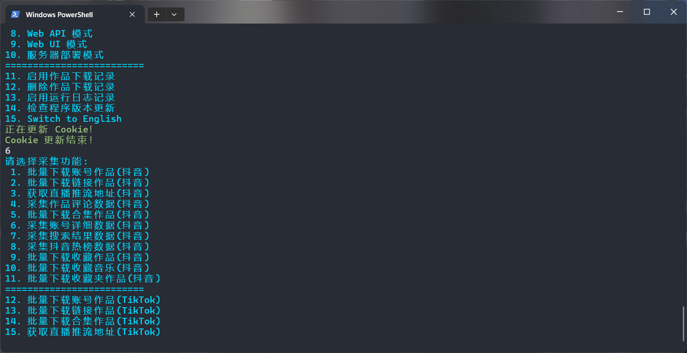
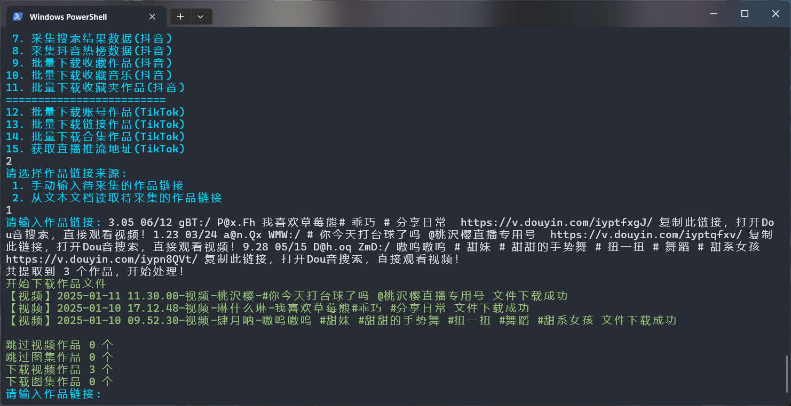
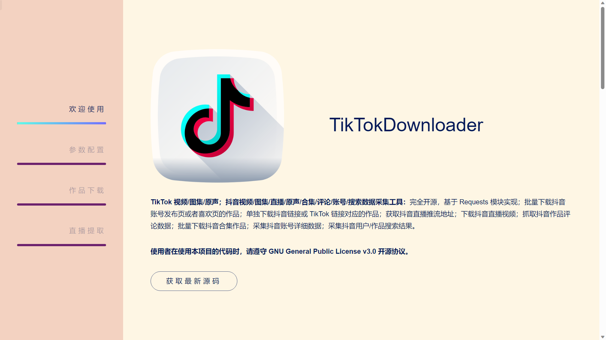
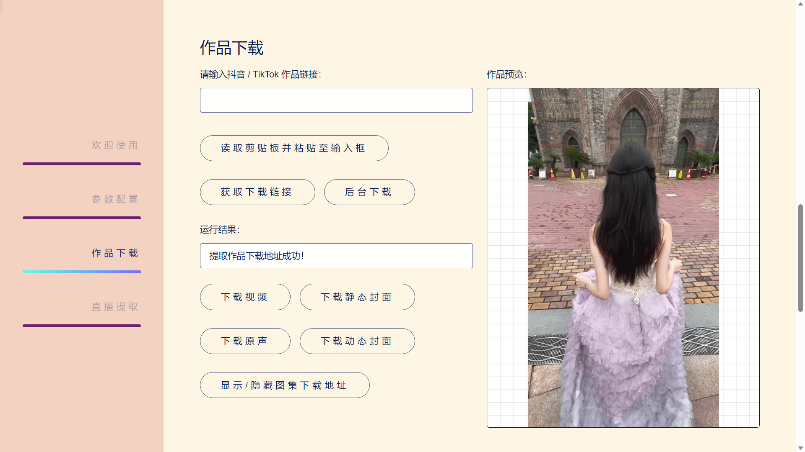
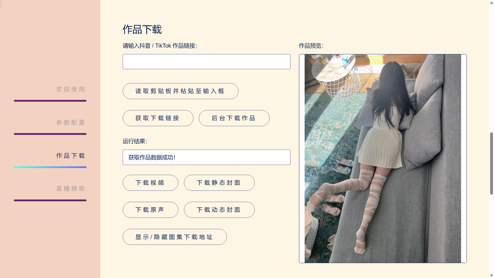
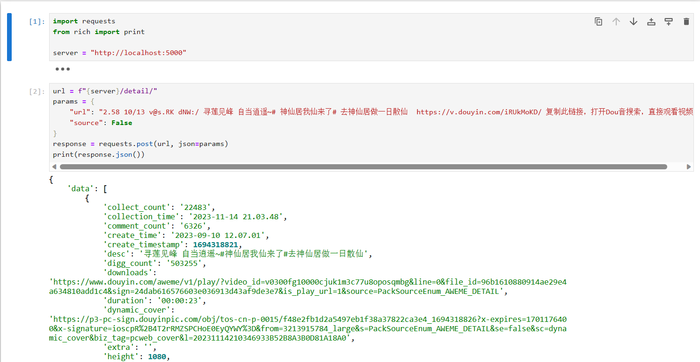

 
<h1>TikTokDownloader</h1>

简体中文 | <a href="README_EN.md">English</a>

 

 

 

🔥 <b>TikTok 发布/喜欢/合辑/直播/视频/图集/音乐；抖音发布/喜欢/收藏/收藏夹/视频/图集/实况/直播/音乐/合集/评论/账号/搜索/热榜数据采集工具：</b>完全开源，基于 HTTPX 模块实现的免费数据采集和文件下载工具；批量下载抖音账号发布、喜欢、收藏、收藏夹作品；批量下载 TikTok 账号发布、喜欢作品；下载抖音链接或 TikTok 链接作品；获取抖音直播推流地址；下载抖音直播视频；获取 TikTok 直播推流地址；下载 TikTok 直播视频；采集抖音作品评论数据；批量下载抖音合集作品；批量下载 TikTok 合辑作品；采集抖音账号详细数据；采集抖音用户 / 作品 / 直播搜索结果；采集抖音热榜数据。

⭐ 本项目完全免费开源，无任何收费功能，请勿上当受骗！

# 📝 项目功能

* ✅ 下载抖音无水印视频/图集
* ✅ 下载抖音无水印实况/动图
* ✅ 下载最高画质视频文件
* ✅ 下载 TikTok 无水印视频/图集
* ✅ 下载抖音账号发布/喜欢/收藏/收藏夹作品
* ✅ 下载 TikTok 账号发布/喜欢作品
* ✅ 采集抖音 / TikTok 详细数据
* ✅ 批量下载链接作品
* ✅ 多账号批量下载作品
* ✅ 自动跳过已下载的文件
* ✅ 持久化保存采集数据
* ✅ 支持 CSV/XLSX/SQLite 格式保存数据
* ✅ 下载动态/静态封面图
* ✅ 获取抖音直播推流地址
* ✅ 获取 TikTok 直播推流地址
* ✅ 调用 ffmpeg 下载直播
* ✅ Web UI 交互界面
* ✅ 采集抖音作品评论数据
* ✅ 下载抖音合集作品
* ✅ 下载 TikTok 合辑作品
* ✅ 记录点赞收藏等统计数据
* ✅ 筛选作品发布时间
* ✅ 支持账号作品增量下载
* ✅ 支持使用代理采集数据
* ✅ 支持局域网远程访问
* ✅ 采集抖音账号详细数据
* ✅ 作品统计数据更新
* ✅ 支持自定义账号/合集标识
* ✅ 自动更新账号昵称/标识
* ✅ 部署至私有服务器
* ✅ 部署至公开服务器
* ✅ 采集抖音搜索数据
* ✅ 采集抖音热榜数据
* ✅ 记录已下载作品 ID
* ☑️ ~~扫码登陆获取 Cookie~~
* ✅ 从浏览器获取 Cookie
* ✅ 支持 Web API 调用
* ✅ 支持多线程下载作品
* ✅ 文件完整性处理机制
* ✅ 自定义规则筛选作品
* ✅ 按文件夹归档保存作品文件
* ✅ 自定义设置文件大小上限
* ✅ 支持文件断点续传下载

# 💻 程序截图

**终端交互模式：**

<b>🎥 点击图片观看演示视频，建议通过配置文件管理账号，更多介绍请查阅 <a href="https://github.com/JoeanAmier/TikTokDownloader/wiki/Documentation">文档</a></b>

*****

*****

  
**Web UI 交互模式：**
  

*****

*****

  
**Web API 接口模式：**
  

# 📈 项目状态

* 🟢 经过测试，[Releases](https://github.com/JoeanAmier/TikTokDownloader/releases/latest) 发布的源码已经验证所有功能正常可用
* 🟡 TikTokDownloader 开发计划及进度可前往 [Projects](https://github.com/users/JoeanAmier/projects/2) 查阅
* 🔴 请注意，最新源码\(Beta 版本\)可能存在一些不稳定的 Bug
* 🔴 如果在使用过程中发现程序 Bug，请及时告知作者修复

# 📋 项目说明

## 快速入门

⭐ Mac OS、Windows 10 及以上用户可前往 <a href="https://github.com/JoeanAmier/TikTokDownloader/releases/latest">Releases</a> 下载已编译的程序，开箱即用！

⭐ 本项目包含手动构建可执行文件的 GitHub Actions，使用者可以随时使用 GitHub Actions 将最新源码构建为可执行文件！

<strong>注意：Mac OS 平台可执行文件 <code>main</code> 可能需要从终端命令行启动；受设备限制，Mac OS 平台可执行文件尚未经过测试，无法保证可用性！</strong>

<ol>
<li><b>运行可执行文件</b> 或者 <b>配置环境运行</b>
<ol><b>运行可执行文件</b>
<li>下载 <a href="https://github.com/JoeanAmier/TikTokDownloader/releases/latest">Releases</a> 或者 Actions 构建的可执行文件压缩包</li>
<li>解压后打开程序文件夹，双击运行 <code>main</code></li>
</ol>
<ol><b>配置环境运行</b>

[//]: # (<li>安装不低于 <code>3.12</code> 版本的 <a href="https://www.python.org/">Python</a> 解释器</li>)
<li>安装 <code>3.12</code> 版本的 <a href="https://www.python.org/">Python</a> 解释器</li>
<li>下载最新的源码或 <a href="https://github.com/JoeanAmier/TikTokDownloader/releases/latest">Releases</a> 发布的源码至本地</li>
<li>运行 <code>python -m venv venv</code> 命令创建虚拟环境（可选）</li>
<li>运行 <code>.\venv\Scripts\activate.ps1</code> 或者 <code>venv\Scripts\activate</code> 命令激活虚拟环境（可选）</li>
<li>运行 <code>pip install -i https://pypi.tuna.tsinghua.edu.cn/simple -r requirements.txt</code> 命令安装程序所需模块</li>
<li>运行 <code>python .\main.py</code> 或者 <code>python main.py</code> 命令启动 TikTokDownloader</li>
</ol>
</li>
<li>阅读 TikTokDownloader 的免责声明，根据提示输入内容</li>
<li>将 Cookie 信息写入配置文件
<ol><b>手动复制粘贴 Cookie（推荐）</b>
<li>参考 <a href="https://github.com/JoeanAmier/TikTokDownloader/blob/master/docs/Cookie%E8%8E%B7%E5%8F%96%E6%95%99%E7%A8%8B.md">Cookie 提取教程</a>，复制所需 Cookie 至剪贴板</li>
<li>选择 <code>复制粘贴写入 Cookie</code> 选项，按照提示将 Cookie 写入配置文件</li>
</ol>
<ol><b>从浏览器获取 Cookie（推荐）</b>
<li>选择 <code>从浏览器获取 Cookie</code> 选项，按照提示选择浏览器类型</li>
</ol>
<ol><b>扫码登录获取 Cookie（弃用）</b>
<li>选择 <code>扫码登录获取 Cookie</code> 选项，程序会显示登录二维码图片，并使用默认应用打开图片</li>
<li>使用抖音 APP 扫描二维码并登录账号</li>
<li>按照提示操作，将 Cookie 写入配置文件</li>
</ol>
</li>
<li>返回程序界面，依次选择 <code>终端交互模式</code> -> <code>批量下载链接作品(通用)</code> -> <code>手动输入待采集的作品链接</code></li>
<li>输入抖音作品链接即可下载作品文件（TikTok 平台需要更多初始设置，详见文档）</li>
<li>更多详细说明请查看 <b><a href="https://github.com/JoeanAmier/TikTokDownloader/wiki/Documentation">项目文档</a></b></li>
</ol>

⭐ 推荐使用 <a href="https://learn.microsoft.com/zh-cn/windows/terminal/install">Windows 终端</a>（Windows 11 自带默认终端）

### Docker 容器

<ol>
<li>获取镜像</li>
<ul>
<li>方式一：使用 <code>Dockerfile</code> 文件构建镜像</li>
<li>方式二：使用 <code>docker pull joeanamier/tiktok-downloader</code> 命令拉取镜像</li>
</ul>
<li>创建容器：<code>docker run -it joeanamier/tiktok-downloader</code></li>
<li>运行容器
<ul>
<li>启动容器：<code>docker start -i 容器名称/容器 ID</code></li>
<li>重启容器：<code>docker restart -i 容器名称/容器 ID</code></li>
</ul>
</li>
</ol>

Docker 容器无法直接访问宿主机的文件系统，部分功能不可用，例如：<code>从浏览器获取 Cookie</code>；其他功能如有异常请反馈！

## 关于 Cookie

[点击查看 Cookie 获取教程](https://github.com/JoeanAmier/TikTokDownloader/blob/master/docs/Cookie%E8%8E%B7%E5%8F%96%E6%95%99%E7%A8%8B.md)

|   程序功能   | 是否需要登录 |
|:--------:|:------:|
| 下载账号发布作品 | ⭕建议登录  |
| 下载账号喜欢作品 | ⭕建议登录  |
|  下载链接作品  | ❌无需登录  |
| 获取直播推流地址 | ❌无需登录  |
|  下载直播视频  | ❌无需登录  |
| 获取作品评论数据 | ❌无需登录  |
|  下载合集作品  | ❌无需登录  |
|  获取账号数据  | ❌无需登录  |
|  采集搜索结果  | ❌无需登录  |
|  采集热榜数据  | ❌无需登录  |
|  下载收藏作品  | ✔️需要登录 |
| 下载收藏夹作品  | ✔️需要登录 |
| 获取收藏合集数据 | ✔️需要登录 |
| 获取收藏音乐数据 | ✔️需要登录 |
| 获取收藏短剧数据 | ✔️需要登录 |

> * Cookie 仅需在失效后重新写入配置文件，并非每次运行程序都要写入配置文件！
>
> * Cookie 会影响下载的视频文件分辨率，如果无法下载最高分辨率的视频文件，请尝试更新 Cookie！
>
> * 程序获取数据失败时，可以尝试更新 Cookie 或者使用已登录的 Cookie！

## 其他说明

<ul>
<li>程序提示用户输入时，直接回车代表返回上级菜单，输入 <code>Q</code> 或 <code>q</code> 代表结束运行</li>
<li>由于获取账号喜欢作品和收藏作品数据仅返回喜欢 / 收藏作品的发布日期，不返回操作日期，因此程序需要获取全部喜欢 / 收藏作品数据再进行日期筛选；如果作品数量较多，可能会花费较长的时间；可通过 <code>max_pages</code> 参数控制请求次数</li>
<li>获取私密账号的发布作品数据需要登录后的 Cookie，且登录的账号需要关注该私密账号</li>
<li>批量下载账号作品或合集作品时，如果对应的昵称或标识发生变化，程序会自动更新已下载作品文件名称中的昵称和标识</li>
<li>程序下载文件时会先将文件下载至临时文件夹，下载完成后再移动至储存文件夹；程序运行结束时会清空临时文件夹</li>
<li><code>批量下载收藏作品模式</code> 目前仅支持下载当前已登录 Cookie 对应账号的收藏作品，暂不支持多账号</li>
<li>如果想要程序使用代理请求数据，必须在 <code>settings.json</code> 设置 <code>proxy</code> 参数，否则程序不会使用代理</li>
<li>退出程序时，请以正常方式结束运行或者按下 Ctrl + C 结束运行，不要直接点击终端窗口的关闭按钮结束运行，否则会导致数据丢失</li>
<li>如果您的计算机没有合适的程序编辑 JSON 文件，建议使用 <a href="https://try8.cn/tool/format/json">JSON 在线工具</a> 编辑配置文件内容</li>
<li>当程序请求用户输入内容或链接时，请注意避免输入的内容或链接包含换行符，这可能会导致预期之外的问题</li>
<li>本项目不会支持付费作品下载，请勿反馈任何关于付费作品下载的问题</li>
<li>Windows 系统需要以管理员身份运行程序才能读取 Chromium、Chrome、Edge 浏览器 Cookie</li>
<li>本项目并未针对程序多开的情况进行优化，如需程序多开，请复制整个项目的文件夹，避免出现预期之外的问题</li>
</ul>

## 程序更新

> **方案一：** 下载并解压文件，将旧版本的 `TikTokDownloader.db` 文件和 `settings.json` 文件复制到 `_internal` 文件夹。

> **方案二：** 下载并解压文件（不要运行程序），复制全部文件，直接覆盖旧版本文件。

## 构建可执行文件指南

本指南将引导您通过 Fork 本仓库并执行 GitHub Actions 自动完成基于最新源码的程序构建和打包！

---

### 使用步骤

#### 1. Fork 本仓库

1. 点击项目仓库右上角的 **Fork** 按钮，将本仓库 Fork 到您的个人 GitHub 账户中
2. 您的 Fork 仓库地址将类似于：`https://github.com/your-username/this-repo`

---

#### 2. 启用 GitHub Actions

1. 前往您 Fork 的仓库页面
2. 点击顶部的 **Settings** 选项卡
3. 点击右侧的 **Actions** 选项卡
4. 点击 **General** 选项
5. 在 **Actions permissions** 下，选择 **Allow all actions and reusable workflows** 选项，点击 **Save** 按钮

---

#### 3. 手动触发打包流程

1. 在您 Fork 的仓库中，点击顶部的 **Actions** 选项卡
2. 找到名为 **手动构建可执行文件** 的工作流
3. 点击右侧的 **Run workflow** 按钮：
    - 选择 **master** 或者 **develop** 分支
    - 点击 **Run workflow**

---

#### 4. 查看打包进度

1. 在 **Actions** 页面中，您可以看到触发的工作流运行记录
2. 点击运行记录，查看详细的日志以了解打包进度和状态

---

#### 5. 下载打包结果

1. 打包完成后，进入对应的运行记录页面
2. 在页面底部的 **Artifacts** 部分，您将看到打包的结果文件
3. 点击下载并保存到本地，即可获得打包好的程序

---

### 注意事项

1. **资源使用**：
    - Actions 的运行环境由 GitHub 免费提供，普通用户每月有一定的免费使用额度（2000 分钟）

2. **代码修改**：
    - 您可以自由修改 Fork 仓库中的代码以定制程序打包流程
    - 修改后重新触发打包流程，您将得到自定义的构建版本

3. **与主仓库保持同步**：
    - 如果主仓库更新了代码或工作流，建议您定期同步 Fork 仓库以获取最新功能和修复

---

### Actions 常见问题

#### Q1: 为什么我无法触发工作流？

A: 请确认您已按照步骤 **启用 Actions**，否则 GitHub 会禁止运行工作流

#### Q2: 打包流程失败怎么办？

A:

- 检查运行日志，了解失败原因
- 确保代码没有语法错误或依赖问题
- 如果问题仍未解决，可以在本仓库的 [Issues 页面](https://github.com/JoeanAmier/TikTokDownloader/issues) 提出问题

#### Q3: 我可以直接使用主仓库的 Actions 吗？

A: 由于权限限制，您无法直接触发主仓库的 Actions。请通过 Fork 仓库的方式执行打包流程

# ⚠️ 免责声明

<ul>
<li>使用者对本项目的使用由使用者自行决定，并自行承担风险。作者对使用者使用本项目所产生的任何损失、责任、或风险概不负责。</li>
<li>本项目的作者提供的代码和功能是基于现有知识和技术的开发成果。作者尽力确保代码的正确性和安全性，但不保证代码完全没有错误或缺陷。</li>
<li>使用者在使用本项目时必须严格遵守 <a href="https://github.com/JoeanAmier/TikTokDownloader/blob/master/license">GNU
    General Public License v3.0</a> 的要求，并在适当的地方注明使用了 <a
        href="https://github.com/JoeanAmier/TikTokDownloader/blob/master/license">GNU General Public License
    v3.0</a> 的代码。
</li>
<li>使用者在任何情况下均不得将本项目的作者、贡献者或其他相关方与使用者的使用行为联系起来，或要求其对使用者使用本项目所产生的任何损失或损害负责。</li>
<li>使用者在使用本项目的代码和功能时，必须自行研究相关法律法规，并确保其使用行为合法合规。任何因违反法律法规而导致的法律责任和风险，均由使用者自行承担。</li>
<li>本项目的作者不会提供 TikTokDownloader 项目的付费版本，也不会提供与 TikTokDownloader 项目相关的任何商业服务。</li>
<li>基于本项目进行的任何二次开发、修改或编译的程序与原创作者无关，原创作者不承担与二次开发行为或其结果相关的任何责任，使用者应自行对因二次开发可能带来的各种情况负全部责任。</li>
</ul>
<b>在使用本项目的代码和功能之前，请您认真考虑并接受以上免责声明。如果您对上述声明有任何疑问或不同意，请不要使用本项目的代码和功能。如果您使用了本项目的代码和功能，则视为您已完全理解并接受上述免责声明，并自愿承担使用本项目的一切风险和后果。</b>
<h1>🌟 贡献指南</h1>

<strong>欢迎对本项目做出贡献！为了保持代码库的整洁、高效和易于维护，请仔细阅读以下指南，以确保您的贡献能够顺利被接受和整合。</strong>

<ul>
<li>在开始开发前，请从 <code>develop</code> 分支拉取最新的代码，以此为基础进行修改；这有助于避免合并冲突并保证您的改动基于最新的项目状态。</li>
<li>如果您的更改涉及多个不相关的功能或问题，请将它们分成多个独立的提交或拉取请求。</li>
<li>每个拉取请求应尽可能专注于单一功能或修复，以便于代码审查和测试。</li>
<li>遵循现有的代码风格；请确保您的代码与项目中已有的代码风格保持一致。</li>
<li>编写可读性强的代码；添加适当的注释帮助他人理解您的意图。</li>
<li>每个提交都应该包含一个清晰、简洁的提交信息，以描述所做的更改。提交信息应遵循以下格式：<code>&lt;类型&gt;: &lt;简短描述&gt;</code></li>
<li>当您准备提交拉取请求时，请优先将它们提交到 <code>develop</code> 分支；这是为了给维护者一个缓冲区，在最终合并到 <code>master</code>
分支之前进行额外的测试和审查。</li>
</ul>

<strong>参考资料：</strong>

<ul>
<li><a href="https://www.contributor-covenant.org/zh-cn/version/2/1/code_of_conduct/">贡献者公约</a></li>
<li><a href="https://opensource.guide/zh-hans/how-to-contribute/">如何为开源做贡献</a></li>
</ul>

# ✉️ 联系作者

<ul>
<li>作者邮箱：yonglelolu@foxmail.com</li>
<li>作者微信: Downloader_Tools</li>
<li>微信公众号: Downloader Tools</li>
<li><b>Discord 社区</b>: <a href="https://discord.com/invite/ZYtmgKud9Y">点击加入社区</a></li>
<li>QQ 群聊(项目交流): <a href="https://github.com/JoeanAmier/TikTokDownloader/blob/master/docs/QQ%E7%BE%A4%E8%81%8A%E4%BA%8C%E7%BB%B4%E7%A0%81.png">扫码加入群聊</a></li>
</ul>

✨ <b>作者的其他开源项目：</b>

<ul>
<li><b>XHS-Downloader（小红书）</b>：<a href="https://github.com/JoeanAmier/XHS-Downloader">https://github.com/JoeanAmier/XHS-Downloader</a></li>
<li><b>KS-Downloader（快手）</b>：<a href="https://github.com/JoeanAmier/KS-Downloader">https://github.com/JoeanAmier/KS-Downloader</a></li>
</ul>

# ♥️ 支持项目

如果 <b>TikTokDownloader</b> 对您有帮助，请考虑为它点个 <b>Star</b> ⭐，感谢您的支持！

<table>
<thead>
<tr>
<th align="center">微信(WeChat)</th>
<th align="center">支付宝(Alipay)</th>
</tr>
</thead>
<tbody><tr>
<td align="center"></td>
<td align="center"></td>
</tr>
</tbody>
</table>

如果您愿意，可以考虑提供资助为 <b>TikTokDownloader</b> 提供额外的支持！

# 💰 项目赞助

## JetBrains 工具

**JetBrains** 支持全球开源社区认可的活跃项目，并为非商业开发提供免费许可证。

***

## TikHub

<a href="https://tikhub.io/">TikHub</a> 是一家领先的数据接口服务供应商，专注于提供高质量的数据接口，涵盖了多个热门平台，包括 抖音、TikTok、小红书、Instagram、Twitter 和 快手 等平台。

TikHub 还提供定制化的服务，如直播间监控、作品监控和达人监控，以满足不同业务场景的需求。

通过每日签到，用户可以免费获取一定额度的使用量；可以使用我的 <strong>推荐链接</strong>：<a href="https://user.tikhub.io/users/signup?referral_code=ZrdH8McC">https://user.tikhub.io/users/signup?referral_code=ZrdH8McC</a> 或 <strong>推荐码</strong>：<code>ZrdH8McC</code>，注册并充值即可获得 <code>$2</code> 额度！

<a href="https://tikhub.io/">TikHub</a> 提供以下服务：

<ul>
<li>丰富的数据接口</li>
<li>每日签到免费获取额度</li>
<li>高质量的 API 服务</li>
<li>官网：<a href="https://tikhub.io/">https://tikhub.io/</a></li>
<li>用户登陆地址：<a href="https://user.tikhub.io/">https://user.tikhub.io/</a></li>
</ul>

# 💡 项目参考

* https://github.com/Johnserf-Seed/f2
* https://github.com/Johnserf-Seed/TikTokDownload
* https://github.com/Evil0ctal/Douyin_TikTok_Download_API
* https://github.com/NearHuiwen/TiktokDouyinCrawler
* https://github.com/ihmily/DouyinLiveRecorder
* https://github.com/encode/httpx/
* https://github.com/Textualize/rich
* https://github.com/omnilib/aiosqlite
* https://github.com/Tinche/aiofiles
* https://github.com/thewh1teagle/rookie
* https://github.com/pyinstaller/pyinstaller
* https://foss.heptapod.net/openpyxl/openpyxl
* https://github.com/carpedm20/emoji/
* https://github.com/lxml/lxml
* https://ffmpeg.org/ffmpeg-all.html
* https://html5up.net/hyperspace
