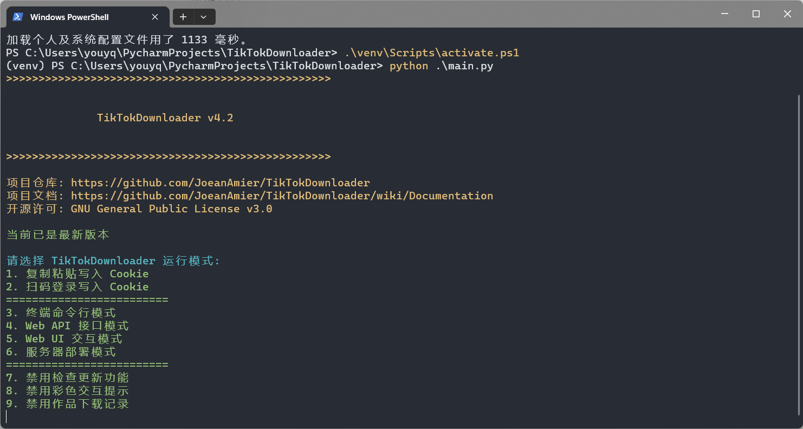
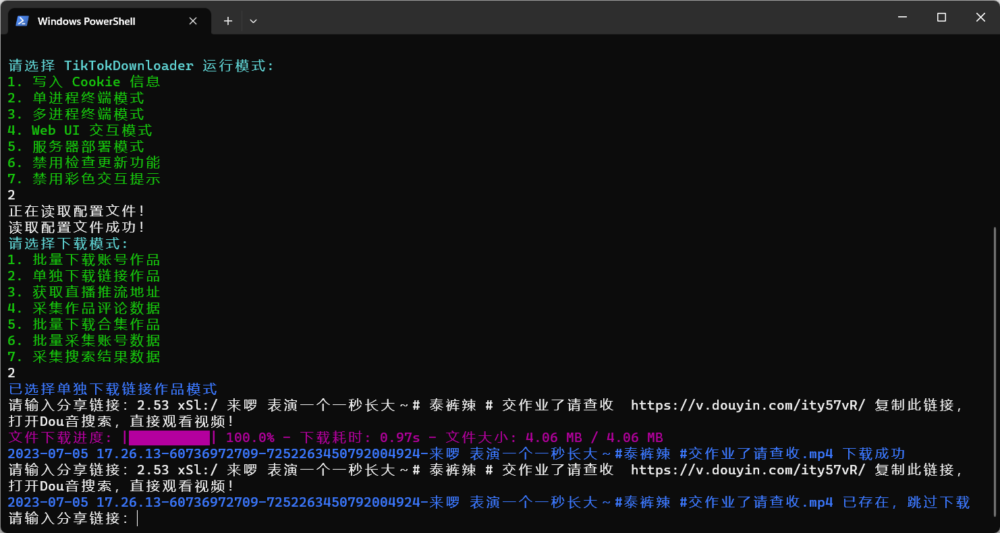
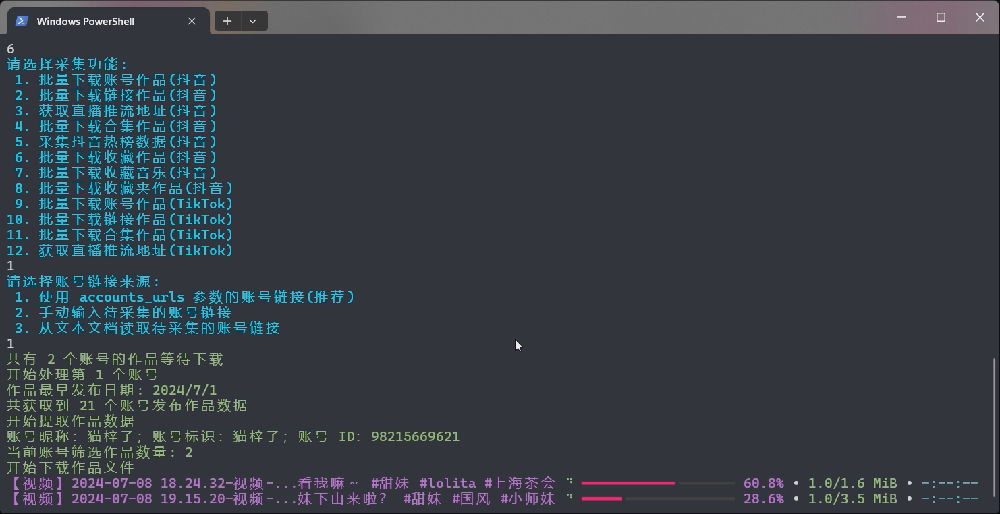

 
<h1>TikTokDownloader</h1>

 

 

🔥 <b>TikTok 主页/视频/图集/原声；抖音主页/视频/图集/收藏/直播/原声/合集/评论/账号/搜索/热榜数据采集工具：</b>完全开源，基于 Requests 模块实现的免费工具；批量下载抖音账号发布、喜欢、收藏作品；批量下载 TikTok 账号主页作品；下载抖音链接或 TikTok 链接作品；获取抖音直播推流地址；下载抖音直播视频；采集抖音作品评论数据；批量下载抖音合集作品；采集抖音账号详细数据；采集抖音用户 / 作品 / 直播搜索结果；采集抖音热榜数据。

⭐ Windows 10 及以上用户可前往 <a href="https://github.com/JoeanAmier/TikTokDownloader/releases/latest">Releases</a> 下载已编译的 exe 程序，开箱即用！

❤️ 作者仅在 GitHub 发布 TikTokDownloader，未与任何个人或网站合作，且没有任何收费计划！

# 📝 功能清单\(Function\)

* ✅ 下载抖音无水印视频/图集
* ✅ 下载 TikTok 无水印视频/图集
* ✅ 批量下载抖音账号发布/喜欢/收藏作品
* ✅ 批量下载 TikTok 账号发布/喜欢作品
* ✅ 采集抖音 / TikTok 详细数据
* ✅ 批量下载链接作品
* ✅ 多账号批量下载作品
* ✅ 自动跳过已下载的文件
* ✅ 持久化保存采集数据
* ✅ 下载动态/静态封面图
* ✅ 获取抖音直播推流地址
* ✅ 调用 ffmpeg 下载直播
* ✅ Web UI 交互界面
* ✅ 采集抖音作品评论数据
* ✅ 批量下载抖音合集作品
* ✅ 记录点赞收藏等统计数据
* ✅ 筛选作品发布时间
* ✅ 支持账号作品增量下载
* ✅ 支持使用代理采集数据
* ✅ 支持局域网远程访问
* ✅ 采集抖音账号详细数据
* ✅ 作品统计数据更新
* ✅ 自动更新账号昵称
* ✅ 部署至私有服务器
* ✅ 部署至公开服务器
* ✅ 采集抖音搜索数据
* ✅ 采集抖音热榜数据
* ✅ 记录已下载作品 ID
* ✅ 扫码登陆获取 Cookie
* ✅ 支持 Web API 调用
* ✅ 支持多线程下载作品
* ✅ 文件完整性处理机制
* ✅ 自定义规则筛选作品

# 💻 程序界面\(Screenshot\)

**终端命令行模式：**
  

*****

  
**Web UI 交互模式：**
  

*****

*****

  
**Web API 接口模式：**
  

# 📽 运行演示\(Example\)

## 批量下载账号发布作品

<b>🎥 点击图片观看演示视频，建议通过配置文件管理账号，更多介绍请查阅 <a href="https://github.com/JoeanAmier/TikTokDownloader/wiki/Documentation">文档</a></b>

# 📈 项目状态\(Status\)

* 🟢 [Releases](https://github.com/JoeanAmier/TikTokDownloader/releases/latest) 发布的源码已完成测试，所有功能均可正常使用
* 🟢 正在重构项目代码，优化项目结构
* 🟢 即将使用协程技术优化项目代码
* 🟡 未来可能新增可视化编辑配置文件功能
* 🟡 未来可能支持更多抖音热榜类型
* 🟡 未来可能新增终端文本用户界面\(TUI\)模式
* 🟡 未来可能支持全功能版的 Web UI 交互模式
* 🟡 未来可能新增监听剪贴板下载作品功能
* 🟡 未来可能新增账号新作品监测功能
* 🟡 未来可能新增合集新作品监测功能
* 🟡 未来可能新增直播开播监测功能
* 🟡 未来可能新增调用 API 下载作品文件功能
* 🟡 未来可能新增获取账号关注列表功能
* 🟡 未来可能新增获取账号收藏合集列表功能
* 🟡 未来可能优化 TikTok 平台批量下载功能
* 🔴 最新版本的源码可能存在不稳定的 Bug
* 🔴 如果在使用过程中发现程序 Bug，请及时告知作者修复
* 🔴 采集 TikTok 图集作品导致异常退出，已修复
* 🔴 发现 Cookie 会影响下载的视频作品文件分辨率

# 📋 项目说明\(Instructions\)

## 快速入门

<ol>
<li><b>下载 EXE 程序</b> 或者 <b>配置运行环境</b>
<ol><b>直接运行程序</b>
<li>下载 <a href="https://github.com/JoeanAmier/TikTokDownloader/releases/latest">Releases</a> 发布的 EXE 程序压缩包</li>
<li>解压后打开程序文件夹，双击运行 <code>main.exe</code></li>
</ol>
<ol><b>通过源码运行</b>
<li>安装不低于 <code>3.12</code> 版本的 <a href="https://www.python.org/">Python</a> 解释器</li>
<li>下载最新的源码或 <a href="https://github.com/JoeanAmier/TikTokDownloader/releases/latest">Releases</a> 发布的源码至本地</li>
<li>运行 <code>python -m venv venv</code> 命令创建虚拟环境（可选）</li>
<li>运行 <code>.\venv\Scripts\activate.ps1</code> 或者 <code>venv\Scripts\activate</code> 命令激活虚拟环境（可选）</li>
<li>运行 <code>pip install -i https://pypi.tuna.tsinghua.edu.cn/simple -r requirements.txt</code> 命令安装程序所需模块</li>
<li>运行 <code>python .\main.py</code> 或者 <code>python main.py</code> 命令启动 TikTokDownloader</li>
</ol>
</li>
<li>阅读 TikTokDownloader 的免责声明，根据提示输入内容</li>
<li>将 Cookie 信息写入配置文件
<ol><b>手动复制粘贴(推荐)</b>
<li>参考 <a href="https://github.com/JoeanAmier/TikTokDownloader/blob/master/docs/Cookie%E6%95%99%E7%A8%8B.md">Cookie 提取教程</a>，复制所需 Cookie 至剪贴板</li>
<li>选择 <code>复制粘贴写入 Cookie</code> 选项，按照提示将 Cookie 写入配置文件</li>
</ol>
<ol><b>扫码登录获取</b>
<li>选择 <code>扫码登陆写入 Cookie</code> 选项，程序会显示登录二维码图片，并使用默认应用打开图片</li>
<li>使用抖音 APP 扫描二维码并登录账号</li>
<li>按照提示操作，将 Cookie 写入配置文件</li>
</ol>
</li>
<li>返回程序界面，依次选择 <code>终端命令行模式</code> -> <code>批量下载链接作品</code></li>
<li>输入抖音或 TikTok 作品链接即可下载作品文件</li>
<li>更多详细说明请查看 <b><a href="https://github.com/JoeanAmier/TikTokDownloader/wiki/Documentation">项目文档</a></b></li>
</ol>

⭐ 推荐使用 <a href="https://learn.microsoft.com/zh-cn/windows/terminal/install">Windows 终端</a>（Windows 11 自带默认终端）

## 关于 Cookie

[点击查看 Cookie 获取教程](https://github.com/JoeanAmier/TikTokDownloader/blob/master/docs/Cookie%E6%95%99%E7%A8%8B.md)

|   程序功能   | 是否需要登录 |
|:--------:|:------:|
| 下载账号发布作品 | ⭕建议登录  |
| 下载账号喜欢作品 | ⭕建议登录  |
|  下载链接作品  | ⭕建议登录  |
| 获取直播推流地址 | ❌无需登录  |
|  下载直播视频  | ❌无需登录  |
| 获取作品评论数据 | ⭕建议登录  |
|  下载合集作品  | ⭕建议登录  |
|  获取账号数据  | ⭕建议登录  |
|  采集搜索结果  | ⭕建议登录  |
|  采集热榜数据  | ❌无需登录  |
| 下载账号收藏作品 | ✔️需要登录 |

**Cookie 仅需在失效后重新写入配置文件，并非每次运行程序都要写入配置文件！**

**程序获取数据失败时，可以尝试更新 Cookie 或者使用已登录的 Cookie！**

## 其他说明

<ul>
<li>程序提示用户输入时，直接回车代表返回上级菜单，输入 <code>Q</code> 或 <code>q</code> 代表结束运行</li>
<li>由于获取账号喜欢作品和收藏作品数据仅返回喜欢 / 收藏作品的发布日期，不返回操作日期，因此程序需要获取全部喜欢 / 收藏作品数据再进行日期筛选；如果作品数量较多，可能会花费较长的时间；可通过 <code>max_pages</code> 参数控制请求次数</li>
<li>获取私密账号的发布作品数据需要登录后的 Cookie，且登录的账号需要关注该私密账号</li>
<li>批量下载账号作品或合集作品时，如果对应的昵称或标识发生变化，程序会自动更新已下载作品文件名称中的昵称和标识</li>
<li>程序下载文件时会先将文件下载至临时文件夹，下载完成后再移动至储存文件夹；程序运行结束时会清空临时文件夹</li>
<li><code>批量下载收藏作品模式</code> 目前仅支持下载当前已登录 Cookie 对应账号的收藏作品，暂不支持多账号</li>
<li>如果想要程序使用代理，必须在 <code>settings.json</code> 设置 <code>proxies</code> 参数，否则程序不会使用代理</li>
<li>部分使用者反馈，新发布的作品过早下载会下载到低分辨率的文件，一段时间后才能下载到高分辨率文件，但时间规律尚不明确</li>
<li>退出程序时，请以正常方式结束运行或者按下 Ctrl + C 结束运行，不要直接点击终端窗口的关闭按钮结束运行，否则会导致数据丢失</li>
<li>如果您的计算机没有合适的程序编辑 JSON 文件，建议使用 <a href="https://try8.cn/tool/format/json">JSON 在线工具</a> 编辑配置文件内容</li>
<li>当程序请求用户输入内容或链接时，请注意避免输入的内容或链接包含换行符，这可能会导致预期之外的问题</li>
</ul>

## EXE 更新

* **方案一：** 下载并解压文件，将旧版本的 `cache` 文件夹和 `settings.json` 文件复制到 `_internal` 文件夹。

* **方案二：** 下载并解压文件，复制全部文件，直接覆盖旧版本文件。

# ⚠️ 免责声明\(Disclaimers\)

<ul>
<li>使用者对本项目的使用由使用者自行决定，并自行承担风险。作者对使用者使用本项目所产生的任何损失、责任、或风险概不负责。</li>
<li>本项目的作者提供的代码和功能是基于现有知识和技术的开发成果。作者尽力确保代码的正确性和安全性，但不保证代码完全没有错误或缺陷。</li>
<li>使用者在使用本项目时必须严格遵守 <a href="https://github.com/JoeanAmier/TikTokDownloader/blob/master/license">GNU
    General Public License v3.0</a> 的要求，并在适当的地方注明使用了 <a
        href="https://github.com/JoeanAmier/TikTokDownloader/blob/master/license">GNU General Public License
    v3.0</a> 的代码。
</li>
<li>使用者在任何情况下均不得将本项目的作者、贡献者或其他相关方与使用者的使用行为联系起来，或要求其对使用者使用本项目所产生的任何损失或损害负责。</li>
<li>使用者在使用本项目的代码和功能时，必须自行研究相关法律法规，并确保其使用行为合法合规。任何因违反法律法规而导致的法律责任和风险，均由使用者自行承担。</li>
<li>本项目的作者不会提供 TikTokDownloader 项目的付费版本，也不会提供与 TikTokDownloader 项目相关的任何商业服务。</li>
<li>基于本项目进行的任何二次开发、修改或编译的程序与原创作者无关，原创作者不承担与二次开发行为或其结果相关的任何责任，使用者应自行对因二次开发可能带来的各种情况负全部责任。</li>
</ul>
<b>在使用本项目的代码和功能之前，请您认真考虑并接受以上免责声明。如果您对上述声明有任何疑问或不同意，请不要使用本项目的代码和功能。如果您使用了本项目的代码和功能，则视为您已完全理解并接受上述免责声明，并自愿承担使用本项目的一切风险和后果。</b>

# ✉️ 联系作者\(Contact\)

<ul>
<li>QQ: 2437596031（联系请说明来意）</li>
<li>QQ Group: <a href="https://github.com/JoeanAmier/TikTokDownloader/blob/master/docs/QQ%E7%BE%A4%E8%81%8A%E4%BA%8C%E7%BB%B4%E7%A0%81.png">点击扫码加入群聊</a></li>
<li>Email: yonglelolu@gmail.com</li>
</ul>

<b>TikTokDownloader 是我个人独立维护的一个开源项目，鉴于个人精力有限，请理解项目进展可能较为缓慢，我会尽力保持更新和维护，以确保项目的稳定性和功能的不断改进。</b>

<b>如果您通过 Email 联系我，我可能无法及时查看并回复信息，我会尽力在七天内回复您的邮件；如果有紧急事项或需要更快的回复，请通过其他方式与我联系，谢谢理解！</b>

<b>如果您对小红书感兴趣，可以了解一下我的另一个开源项目 <a href="https://github.com/JoeanAmier/XHS-Downloader">XHS-Downloader</a></b>

# ♥️ 支持项目\(Support\)

如果 <b>TikTokDownloader</b> 对您有帮助，请考虑为它点个 <b>Star</b> ⭐，感谢您的支持！

<table>
<thead>
<tr>
<th align="center">微信(WeChat)</th>
<th align="center">支付宝(Alipay)</th>
</tr>
</thead>
<tbody><tr>
<td align="center"></td>
<td align="center"></td>
</tr>
</tbody>
</table>

如果您愿意，可以考虑提供资助为 <b>TikTokDownloader</b> 提供额外的支持！

# 💡 代码参考\(Refer\)

* https://github.com/Johnserf-Seed/f2
* https://github.com/Johnserf-Seed/TikTokDownload
* https://github.com/Evil0ctal/Douyin_TikTok_Download_API
* https://github.com/ihmily/DouyinLiveRecorder
* https://github.com/davidteather/TikTok-Api
* https://github.com/psf/requests
* https://github.com/pallets/flask
* https://github.com/Textualize/rich
* https://github.com/pyinstaller/pyinstaller
* https://ffmpeg.org/ffmpeg-all.html
* https://html5up.net/hyperspace
