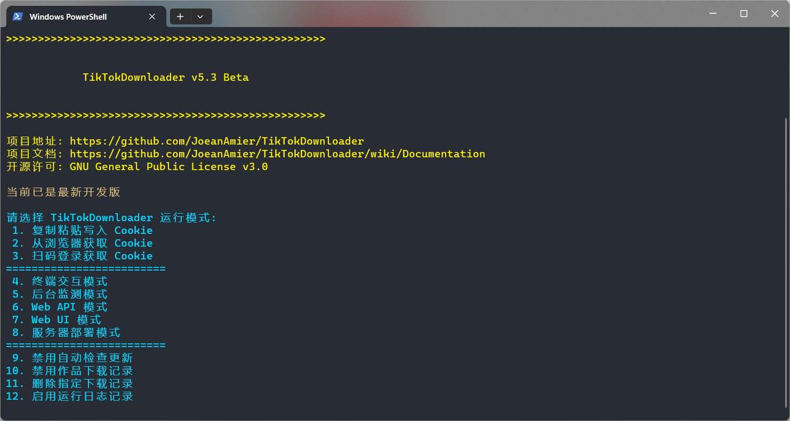
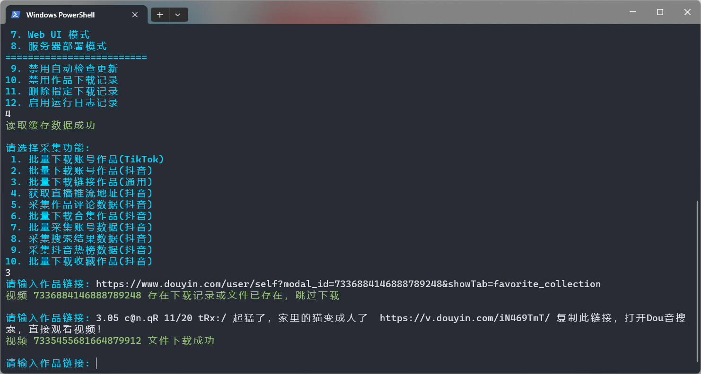

 
<h1>TikTokDownloader</h1>

 

 

🔥 <b>TikTok homepage/video/album/original sound; Douyin homepage/video/album/collection/live broadcast/original sound/collection/comments/account/search/hot list data collection tool:</b> Completely open source, a free tool implemented based on the Requests module; batch download works posted, liked, and collected by Douyin accounts; batch download works on TikTok account homepages; download Douyin links or TikTok linked works; obtain Douyin live streaming address; download Douyin Live video streaming; collect comment data on Douyin works; download Douyin collection works in batches; collect detailed data on Douyin accounts; collect Douyin users/works/live broadcast search results; and collect Douyin hot list data. 

⭐ Windows 10 and above users can go to <a href="https://github.com/JoeanAmier/TikTokDownloader/releases/latest">Releases</a> to download the compiled exe program and use it out of the box! 

❤️ The author only publishes TikTokDownloader on GitHub, and does not cooperate with any individual or website to publish it. The project does not have any charging plan, so be careful not to be deceived! 

# 📝 Project function\(Function\)

* ✅ Download Douyin videos/photo albums without watermarks
* ✅ Download TikTok watermark-free videos/photo albums
* ✅ Batch download works posted/liked/collected by Douyin account
* ✅ Batch download works posted/liked by TikTok account
* ✅ Collect Douyin/TikTok detailed data
* ✅ Batch download link works
* ✅ Batch download works with multiple accounts
* ✅ Automatically skip downloaded files
* ✅ Persistent storage of collected data
* ✅ Download dynamic/static cover images
* ✅ Get Douyin live streaming address
* ✅ Call ffmpeg to download live broadcast
* ✅ Web UI interactive interface
* ✅ Collect comment data of Douyin works
* ✅ Batch download Douyin collection works
* ✅ Record statistics such as likes and collections
* ✅ Filter the release time of works
* ✅ Support incremental download of account works
* ✅ Supports the use of agents to collect data
* ✅ Support LAN remote access
* ✅ Collect Douyin account details
* ✅ Work statistics updated
* ✅ Automatically update account nickname
* ✅Deploy to private server
* ✅Deploy to public server
* ✅ Collect Douyin search data
* ✅ Collect Douyin hot list data
* ✅ Record downloaded work ID
* ✅ Scan the QR code to log in to get cookies
* ✅Supports Web API calls
* ✅ Supports multi-threaded downloading of works
* ✅ File integrity processing mechanism
* ✅ Customize rules to filter works

# 💻 Program interface\(Screenshot\)

**Terminal interactive mode:**
  

*****

  
**Web UI interactive mode:**
  

*****

*****

  
**Web API interface mode:**
  

# 📽 Run the demo\(Example\)

## Batch download accounts to publish works

<b>🎥 Click on the picture to watch the demonstration video. It is recommended to manage the account through the configuration file. For more introduction, please refer to the <a href="https://github.com/JoeanAmier/TikTokDownloader/wiki/Documentation">Documentation</ a></b>

# 📈Project status\(Status\)

* 🟢 After testing, the source code released by [Releases](https://github.com/JoeanAmier/TikTokDownloader/releases/latest) has been verified that all functions are available normally.
* 🟡 TikTokDownloader development plan and progress can be viewed at [Projects](https://github.com/users/JoeanAmier/projects/2)
* 🔴 Please note that the latest source code may have some unstable bugs
* 🔴 If you find a program bug during use, please inform the author in time to fix it
* 🔴 Collecting TikTok album works resulted in abnormal exit, which has been fixed
* 🔴 Failed to read HTML files in some cases, fixed

# 📋Project instructions\(Instructions\)

## Quick Start

<ol>
<li><b>Download the EXE program</b> or <b>Configure the running environment</b>
<ol><b>Download the program and run it</b>
<li>Download the EXE program compressed package released by <a href="https://github.com/JoeanAmier/TikTokDownloader/releases/latest">Releases</a></li>
<li>After unzipping, open the program folder and double-click to run <code>main.exe</code></li>
</ol>
<ol><b>Run from source</b>
<li>Install a <a href="https://www.python.org/">Python</a> interpreter</li> that is at least <code>3.12</code>
<li>Download the latest source code or source code released by <a href="https://github.com/JoeanAmier/TikTokDownloader/releases/latest">Releases</a> to your local computer</li>
<li>Run the <code>python -m venv venv</code> command to create a virtual environment (optional)</li>
<li>Run <code>.\venv\Scripts\activate.ps1</code> or <code>venv\Scripts\activate</code> command to activate the virtual environment (optional)</li>
<li>Run the <code>pip install -i https://pypi.tuna.tsinghua.edu.cn/simple -r requirements.txt</code> command to install the required modules for the program</li>
<li>Run <code>python .\main.py</code> or <code>python main.py</code> command to start TikTokDownloader</li>
</ol>
</li>
<li>Read the disclaimer of TikTokDownloader and enter the content according to the prompts</li>
<li>Write cookie information to configuration file
<ol><b>Manual copy and paste (recommended)</b>
<li>Reference<a href="https://github.com/JoeanAmier/TikTokDownloader/blob/master/docs/Cookie%E6%95%99%E7%A8%8B.md">Cookie extraction tutorial</a >, copy the required cookies to the clipboard</li>
<li>Select the <code>Copy and paste to write Cookie</code> option and follow the prompts to write the Cookie to the configuration file</li>
</ol>
<ol><b>Scan the QR code to log in to get it (will be removed soon)</b>
<li>Select the <code>Scan code to log in and write Cookie</code> option, the program will display the login QR code image and use the default application to open the image</li>
<li>Use Douyin APP to scan the QR code and log in to your account</li>
<li>Follow the prompts and write cookies to the configuration file</li>
</ol>
</li>
<li>Return to the program interface and select <code>Terminal interactive mode</code> -> <code>Batch download linked works</code></li>
<li>Enter the Douyin or TikTok work link to download the work file</li>
<li>For more detailed instructions, please see <b><a href="https://github.com/JoeanAmier/TikTokDownloader/wiki/Documentation">Project Documentation</a></b></li>
</ol>

⭐ It is recommended to use <a href="https://learn.microsoft.com/zh-cn/windows/terminal/install">Windows Terminal</a> (Windows 11 comes with the default terminal)

## About Cookies

[Click to view Cookie for tutorial](https://github.com/JoeanAmier/TikTokDownloader/blob/master/docs/Cookie%E6%95%99%E7%A8%8B.md)

| Program functions | Do you need to log in |
|:--------:|:------:|
| Download account to publish works | ⭕Recommended to log in |
| Download account and like works | ⭕Recommended to log in |
| Download link works | ⭕Recommended to log in |
| Get the live streaming address | ❌ No login required |
| Download live video | ❌No login required |
| Obtain work review data | ⭕Recommended to log in |
| Download collection works | ⭕Recommended to log in |
| Get account data | ⭕Recommended to log in |
| Collect search results | ⭕Recommended to log in |
| Collect hot list data | ❌ No login required |
| Download account collection works | ✔️Login required |

> * Cookie only needs to rewrite the configuration file after expiration, not every time the program is run, the configuration file needs to be written!
>
> * Cookies will affect the resolution of downloaded video files. If you cannot download 1080P video files, please try to update Cookies!
>
> * When the program fails to obtain data, you can try to update the cookie or use the logged-in cookie!

## other instructions

<ul>
<li><b>Some functions of the project are disabled by default. If you need to enable the function, please run the project through the source code and uncomment the corresponding code</b></li>
<li>When the program prompts the user for input, just press Enter to return to the upper-level menu. Enter <code>Q</code> or <code>q</code> to end the run</li>
<li>Since obtaining the data of the account's liked works and collected works only returns the release date of the liked/collected works, and does not return the operation date, the program needs to obtain all the data of the liked/collected works and then perform date filtering; if the number of works is large, it may It takes a long time; you can control the number of requests through the <code>max_pages</code> parameter</li>
<li>Getting the published work data of a private account requires a logged-in cookie, and the logged-in account needs to follow the private account</li>
<li>When downloading account works or collection works in batches, if the corresponding nickname or logo changes, the program will automatically update the nickname and logo in the file name of the downloaded work</li>
<li>When the program downloads a file, it will first download the file to a temporary folder, and then move it to the storage folder after the download is completed; the temporary folder will be cleared when the program ends</li>
<li><code>Batch download mode of collected works</code> Currently only supports downloading the collected works of the account corresponding to the currently logged-in cookie. Multiple accounts are not supported at the moment</li>
<li>If you want the program to use a proxy, you must set the <code>proxies</code> parameter in <code>settings.json</code>, otherwise the program will not use the proxy</li>
<li>When exiting the program, please end it in the normal way or press Ctrl + C to end it. Do not directly click the close button of the terminal window to end it, otherwise data will be lost</li>
<li>If your computer does not have a suitable program to edit JSON files, it is recommended to use the <a href="https://try8.cn/tool/format/json">JSON online tool</a> to edit the configuration file contents</ li>
<li>When the program asks the user to enter content or links, please be careful to avoid entering content or links that contain line breaks, which may cause unexpected problems</li>
</ul>

## Program update

> ### Free installation program
>
>> **Option 1:** Download and unzip the file, and copy the old version of the `cache` folder and `settings.json` file to the `_internal` folder.
>
>> **Option 2:** Download and unzip the file, copy all files, and directly overwrite the old version of the file.
>
> ### Installer
>
>> **Stay tuned! **

# ⚠️Disclaimers\(Disclaimers\)

<ul>
<li>User's use of this project is at the user's own discretion and risk. The author is not responsible for any losses, liabilities, or risks incurred by users using this project. </li>
<li>The code and functions provided by the authors of this project are developed based on existing knowledge and technology. The author tries his best to ensure the correctness and security of the code, but does not guarantee that the code is completely free of errors or defects. </li>
<li>Users must strictly abide by <a href="https://github.com/JoeanAmier/TikTokDownloader/blob/master/license">GNU when using this project
     General Public License v3.0</a>, noting the use of <a where appropriate
         href="https://github.com/JoeanAmier/TikTokDownloader/blob/master/license">GNU General Public License
     v3.0</a>'s code.
</li>
<li>The user may not under any circumstances associate the authors, contributors or other relevant parties of this project with the user's use of the project, or require them to be responsible for any loss or damage caused by the user's use of the project. </li>
<li>Users must research relevant laws and regulations on their own when using the code and functions of this project, and ensure that their usage is legal and compliant. Any legal liability and risk caused by violation of laws and regulations shall be borne by the user. </li>
<li>The author of this project will not provide a paid version of the TikTokDownloader project, nor will it provide any commercial services related to the TikTokDownloader project. </li>
<li>Any secondary development, modification or compilation of programs based on this project has nothing to do with the original author. The original author does not assume any responsibility related to the secondary development behavior or its results. The user should be responsible for the possible consequences of secondary development. Take full responsibility for any situation that arises. </li>
</ul>
<b>Please carefully consider and accept the above disclaimer before using the code and functions of this project. If you have any questions or disagree with the above statement, please do not use the code and functions of this project. If you use the code and functions of this project, you are deemed to have fully understood and accepted the above disclaimer, and you voluntarily bear all risks and consequences of using this project. </b>

# ✉️ Contact the author\(Contact\)

<ul>
<li>QQ: 2437596031 (please state your intention when contacting)</li>
<li>QQ Group: <a href="https://github.com/JoeanAmier/TikTokDownloader/blob/master/docs/QQ%E7%BE%A4%E8%81%8A%E4%BA%8C%E7 %BB%B4%E7%A0%81.png">Click to scan the QR code to join the group chat</a></li>
<li>Email: yonglelolu@gmail.com</li>
</ul>

<b>If you encounter problems when using TikTokDownloader, please read first<a href="https://github.com/ryanhanwu/How-To-Ask-Questions-The-Smart-Way/blob/main/ README-zh_CN.md">"The Wisdom of Asking Questions"</a>, then join the QQ group chat for help! </b>

<b>If you contact me via email, I may not be able to check and reply to the message in time. I will try my best to reply to your email within seven days; if there is an urgent matter or you need a faster reply, please contact me through other methods, thank you understand! </b>

<b>If you are interested in Xiaohongshu, you can learn about another open source project of mine <a href="https://github.com/JoeanAmier/XHS-Downloader">XHS-Downloader</a ></b>

# ♥️ Support project\(Support\)

If <b>TikTokDownloader</b> is helpful to you, please consider giving it a <b>Star</b> ⭐, thank you for your support! 

<table>
<thead>
<tr>
<th align="center">WeChat</th>
<th align="center">Alipay</th>
</tr>
</thead>
<tbody><tr>
<td align="center"></td>
<td align="center"></td>
</tr>
</tbody>
</table>

If you'd like, consider making a grant to provide additional support for <b>TikTokDownloader</b>! 

# 💡 Code Reference\(Refer\)

* https://github.com/Johnserf-Seed/f2
* https://github.com/Johnserf-Seed/TikTokDownload
* https://github.com/Evil0ctal/Douyin_TikTok_Download_API
* https://github.com/ihmily/DouyinLiveRecorder
* https://github.com/davidteather/TikTok-Api
* https://github.com/psf/requests
* https://github.com/pallets/flask
* https://github.com/Textualize/rich
* https://github.com/pyinstaller/pyinstaller
* https://ffmpeg.org/ffmpeg-all.html
* https://html5up.net/hyperspace
