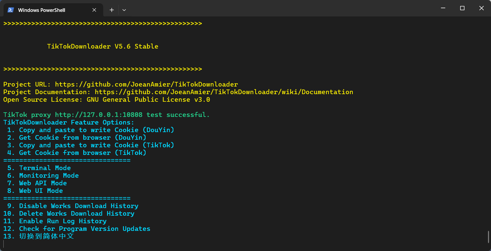
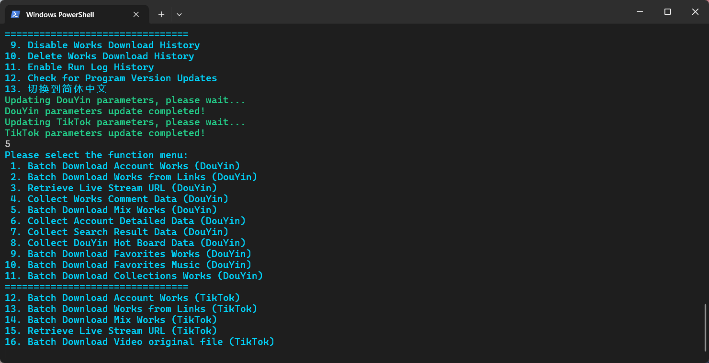
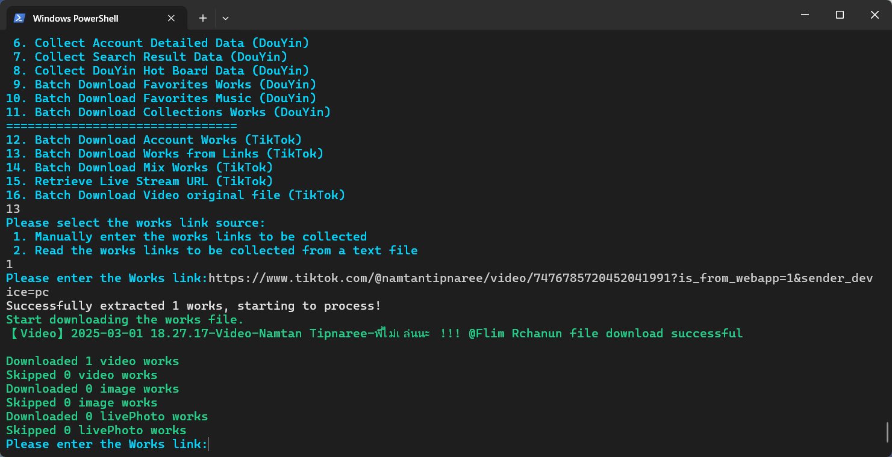
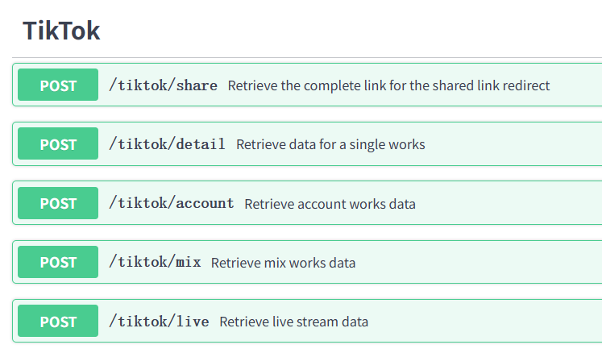
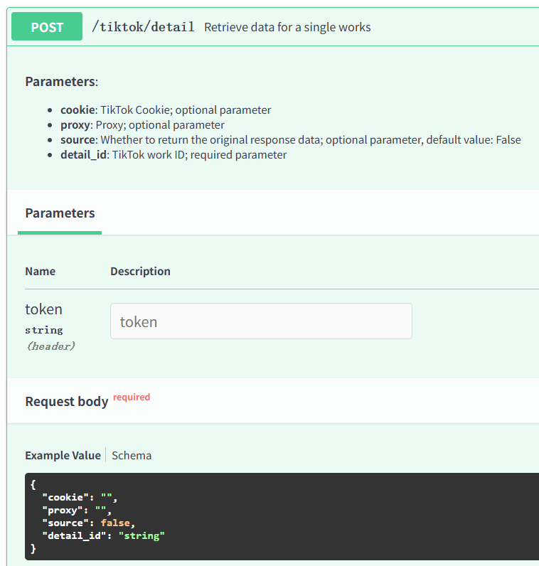

<div align="center">
<br>
<h1>DouK-Downloader</h1>
<p><a href="README.md">简体中文</a> | English</p>
<a href="https://trendshift.io/repositories/6222" target="_blank"></a>
<br>


<br>


</div>
<br>
<p>🔥 <b>TikTok Posts/Liked/Mix/Live/Video/Image/Music; DouYin Posts/Liked/Favorites/Collections/Video/Image/LivePhoto/Live/Music/Mix/Comments/Account/Search/Hot Board Data Acquisition Tools:</b> Fully open-source, free data collection and file download tool based on HTTPX module implementation; batch download of DouYin account posts works, liked works, favorites works and collections works; batch download of TikTok account posts works and liked works; download of DouYin linked or TikTok linked works; obtain DouYin live stream addresses; download DouYin live stream video; obtain TikTok live stream addresses; download TikTok live stream video; collect DouYin works comments data; batch download of DouYin Mix works; batch download of TikTok Mix works; collect detailed data of DouYin accounts; collect DouYin user/works/live search results; collect DouYin Hot Board data.</p>
<p>⭐ Previous project names: <code>TikTokDownloader</code></p>
<p>⭐ Due to the author's limited energy, I was unable to update the English document in a timely manner, and the content may have become outdated, partial translation is machine translation, the translation result may be incorrect, Suggest referring to Chinese documentation. If you want to contribute to translation, we warmly welcome you.</p>
<hr>

# 📝 Project Features

<details>
<summary>Function List (Click to Expand)</summary>
<ul>
<li>✅ Download DouYin video/image without watermarks</li>
<li>✅ Download DouYin live photo without watermarks</li>
<li>✅ Download the highest quality video file</li>
<li>✅ Download TikTok video source files</li>
<li>✅ Download TikTok video/image without watermarks</li>
<li>✅ Download of DouYin account posts/liked/favorites works</li>
<li>✅ Download of TikTok account posts/liked works</li>
<li>✅ Collect detailed data from DouYin/TikTok</li>
<li>✅ Batch download of linked works</li>
<li>✅ Batch download of works from multiple accounts</li>
<li>✅ Automatically skip already downloaded files</li>
<li>✅ Persistently save collected data</li>
<li>✅ Support CSV/XLSX/SQLite format for saving data</li>
<li>✅ Download dynamic/static cover images</li>
<li>✅ Obtain DouYin live stream addresses</li>
<li>✅ Obtain TikTok live stream addresses</li>
<li>✅ Use ffmpeg to download live video</li>
<li>✅ Web UI interaction interface</li>
<li>✅ Collect comments data from DouYin works</li>
<li>✅ Batch download of DouYin Mix works</li>
<li>✅ Batch download of TikTok Mix works</li>
<li>✅ Record statistics such as likes and favorites</li>
<li>✅ Filter works based on publication time</li>
<li>✅ Support incremental downloading of account works</li>
<li>✅ Support data Collections using proxies</li>
<li>✅ Support remote access via LAN</li>
<li>✅ Collect detailed data from DouYin accounts</li>
<li>✅ Update statistics of works</li>
<li>✅ Support custom account/mix mark</li>
<li>✅ Automatically update account nickname/mark</li>
<li>✅ Deploy to private servers</li>
<li>✅ Deploy to public servers</li>
<li>✅ Collect DouYin search data</li>
<li>✅ Collect DouYin hot board data</li>
<li>✅ Record IDs of already downloaded works</li>
<li>☑️ <del>Scan QR code to log in and obtain Cookies</del></li>
<li>✅ Obtain Cookies from browsers</li>
<li>✅ Support Web API calls</li>
<li>✅ Support multithreaded downloading of works</li>
<li>✅ File integrity processing mechanism</li>
<li>✅ Custom rules for filtering works</li>
<li>✅ Archive and save works files by folder</li>
<li>✅ Customize file size limit</li>
<li>✅ Support resume downloading of files from breakpoints</li>
<li>✅ Monitor clipboard links to download works</li>
</ul>
</details>

# 💻 Program Screenshot

## Terminal interaction mode

<p><b>🎥 Click on the image to watch the demonstration video. It is recommended to manage accounts through configuration files. For more information, please refer to the <a href="https://github.com/JoeanAmier/TikTokDownloader/wiki/Documentation">documentation</a></b></p>

[](https://www.bilibili.com/video/BV18tVDzVEK7/)
*****
[](https://www.bilibili.com/video/BV18tVDzVEK7/)
*****
[](https://www.bilibili.com/video/BV18tVDzVEK7/)

## Web UI interaction mode

> **The project code has been refactored; the code for this mode has not yet been updated. It will be reopened after
future development is completed!**

## Web API mode


*****


> **After starting this mode, Open http://127.0.0.1:5555/docs or http://127.0.0.1:5555/redoc to access the automatically
generated documentation!**

### API call example code

```python
from httpx import post
from rich import print


def demo():
    headers = {"token": ""}
    data = {
        "detail_id": "0123456789",
        "pages": 2,
    }
    api = "http://127.0.0.1:5555/douyin/comment"
    response = post(api, json=data, headers=headers)
    print(response.json())


demo()
```

# 📋 Project Instructions

## Quick Start

<p>⭐ Mac OS and Windows 10 and above users can go to <a href="https://github.com/JoeanAmier/TikTokDownloader/releases/latest">Releases</a> or <a href="https://github.com/JoeanAmier/TikTokDownloader/actions">Actions</a> to download the compiled program, ready to use!</p>
<p>⭐ This project includes GitHub Actions for automatic building executable files. Users can use GitHub Actions to build the latest source code into executable files at any time!</p>
<p>⭐ For the automatic building executable files tutorial, please refer to the <code>Build of Executable File Guide</code> section of this document. If you need a more detailed step-by-step tutorial with illustrations, please <a href="https://mp.weixin.qq.com/s/TorfoZKkf4-x8IBNLImNuw">check out this article</a>!</p>
<p><strong>Note: The executable file <code>main</code> on Mac OS may need to be started from the terminal command line. Due to device limitations, the executable file on the Mac OS platform has not been tested, and its usability cannot be guaranteed!</strong></p>
<hr>
<ol>
<li><b>Run the executable file</b> or <b>configure the environment to run</b>
<ol><b>Run the executable file</b>
<li>Download the executable file compressed file built by <a href="https://github.com/JoeanAmier/TikTokDownloader/releases/latest">Releases</a> or Actions.</li>
<li>After extracting, open the program folder and double-click to run <code>main</code>.</li>
</ol>
<ol><b>Configure the environment to run</b>

[//]: # (<li>Install Python interpreter version not lower than <code>3.12</code></li>)
<li>Install Python interpreter version <code>3.12</code></li>
<li>Download the latest source code or the source code published on <a href="https://github.com/JoeanAmier/TikTokDownloader/releases/latest">Releases</a> to your local machine.</li>
<li>Run the command <code>python -m venv venv</code> to create a virtual environment (optional).</li>
<li>Run the command <code>.\venv\Scripts\activate.ps1</code> or <code>venv\Scripts\activate</code> to activate the virtual environment (optional).</li>
<li>Run the command <code>pip install -r requirements.txt</code> to install the required modules for the program.</li>
<li>Run the command <code>python .\main.py</code> or <code>python main.py</code> to start DouK-Downloader.</li>
</ol>
</li>
<li>Read the disclaimer of DouK-Downloader and enter content according to the prompt.</li>
<li>Write Cookie Information into Configuration File 
<ol><b>Read Cookie from Clipboard</b>
<li>Refer to the <a href="https://github.com/JoeanAmier/TikTokDownloader/blob/master/docs/Cookie%E8%8E%B7%E5%8F%96%E6%95%99%E7%A8%8B.md">Cookie Extraction Tutorial</a>, copy the required Cookie to the clipboard</li>
<li>Select the <code>Read Cookie from Clipboard</code> option, the program will automatically read the Cookie from the clipboard and write it into the configuration file</li>
</ol>
<ol><b>Read Cookie from Browser</b>
<li>Select the <code>Read Cookie from Browser</code> option, then follow the prompts to input the browser type or its corresponding number</li>
</ol>
<ol><b><del>Obtain Cookie via QR Code Login</del> (No longer valid)</b>
<li><del>Select the <code>Obtain Cookie via QR Code Login</code> option, the program will display a login QR code image and open it with the default application</del></li>
<li><del>Use the TikTok app to scan the QR code and log in</del></li>
<li><del>Follow the prompts, the program will automatically write the Cookie into the configuration file</del></li>
</ol>
</li>
<li>Return to the program interface, sequentially select <code>Terminal interactive mode</code> -> <code>Batch download link works (general)</code> -> <code>Manually enter the link of the works to be collected</code>.</li>
<li>Input the DouYin works link to download the works file (the TikTok platform requires more initial setup, please refer to the documentation for details).</li>
<li>For more detailed instructions, please see <b><a href="https://github.com/JoeanAmier/TikTokDownloader/wiki/Documentation">Project Documentation</a></b>.</li>
</ol>
<p>⭐ It is recommended to use <a href="https://learn.microsoft.com/zh-cn/windows/terminal/install">Windows Terminal</a> (the default terminal that comes with Windows 11).</p>

### Docker Container

<ol>
<li>Get the image</li>
<ul>
<li>Method 1: Build the image using the <code>Dockerfile</code>.</li>
<li>Method 2: Pull the image using the command <code>docker pull joeanamier/tiktok-downloader</code>.</li>
<li>Method 3: Pull the image using the command <code>docker pull ghcr.io/joeanamier/tiktok-downloader</code>.</li>
</ul>
<li>Create the container: <code>docker run --name ContainerName(optional) -p HostPort:5555 -v tiktok_downloader_volume:/app/Volume -it &lt;image name&gt;</code>.</li>
<br><b>Note:</b> The <code>&lt;image name&gt;</code> here must be consistent with the image name you used in the first step (<code>joeanamier/tiktok-downloader</code> or <code>ghcr.io/joeanamier/tiktok-downloader</code>)
<li>Run the container
<ul>
<li>Start the container: <code>docker start -i container name/container ID</code>.</li>
<li>Restart the container: <code>docker restart -i container name/container ID</code>.</li>
</ul>
</li>
</ol>
<p>Docker containers cannot directly access the host machine's file system, and some features may be unavailable, for example: <code>Get Cookie from Browser</code>; if there are any other issues, please report!</p>
<hr>

## About Cookie

[Click to view Cookie tutorial](https://github.com/JoeanAmier/TikTokDownloader/blob/master/docs/Cookie%E8%8E%B7%E5%8F%96%E6%95%99%E7%A8%8B.md)

> * Cookie only needs to be re-written to the configuration file after it expires, and not every time the program is
    run.
>
> * The Cookie can affect the resolution of the video files downloaded from the DouYin platform. If you are unable to
    download high-resolution video files, please try updating the Cookie!
>
> * When the program fails to obtain data, you can try updating the Cookie or using a Cookie that is already logged in!

<hr>

## Other Instructions

<ul>
<li>When the program prompts the user for input, pressing Enter directly will return to the previous menu, and inputting <code>Q</code> or <code>q</code> will end the program's execution.</li>
<li>Since fetching data for liked and favorites works of an account only returns the publication dates of those works, not the dates of the actions (liking or favouring), the program needs to retrieve all liked and favorites works data before performing date filtering. If there are a large number of works, this may take a considerable amount of time. The number of requests can be controlled via the <code>max_pages</code> parameter.</li>
<li>To obtain data for posts made by a private account, a logged-in Cookie is required, and the logged-in account must follow the private account.</li>
<li>When batch downloading account posts works or mix works, if the corresponding nickname or mark parameter changes, the program will automatically update the nickname and mark parameter in the file names of the downloaded works.</li>
<li>When downloading files, the program first downloads them to a temporary folder and then moves them to the storage folder upon completion. The temporary folder will be emptied when the program ends.</li>
<li>The <code>Batch Download Favorites Works Mode</code> currently only supports downloading Favorites works for the account corresponding to the currently logged-in Cookie and does not support multiple accounts.</li>
<li>If you want the program to use a proxy to request data, you must set the <code>proxy</code> parameter in <code>settings.json</code>; otherwise, the program will not use a proxy.</li>
<li>If your computer does not have a suitable program for editing JSON files, we recommend using the <a href="https://try8.cn/tool/format/json">JSON Online Tool</a> to edit the configuration file content.</li>
<li>When the program prompts the user to input content or links, please be careful to avoid including newline characters, as this may cause unexpected issues.</li>
<li>This project does not support downloading paid works. Please do not report any issues related to downloading paid works.</li>
<li>On Windows systems, the program needs to be run as an administrator to read Cookies from Chromium, Chrome, and Edge browsers.</li>
<li>This project has not been optimized for running multiple instances of the program. If you need to run multiple instances, please copy the entire project folder to avoid unexpected issues.</li>
<li>During program execution, if you need to terminate the program or <code>ffmpeg</code>, please press <code>Ctrl + C</code> to stop the process. Do not click the close button on the terminal window directly.</li>
</ul>
<h2>Build of Executable File Guide</h2>
<details>
<summary>Build of Executable File Guide (Click to Expand)</summary>

This guide will walk you through forking this repository and executing GitHub Actions to automatically build and package
the program based on the latest source code!

---

### Steps to Use

#### 1. Fork the Repository

1. Click the **Fork** button at the top right of the project repository to fork it to your personal GitHub account
2. Your forked repository address will look like this: `https://github.com/your-username/this-repo`

---

#### 2. Enable GitHub Actions

1. Go to the page of your forked repository
2. Click the **Settings** tab at the top
3. Click the **Actions** tab on the right
4. Click the **General** option
5. Under **Actions permissions**, select **Allow all actions and reusable workflows** and click the **Save** button

---

#### 3. Manually Trigger the Build Process

1. In your forked repository, click the **Actions** tab at the top
2. Find the workflow named **构建可执行文件**
3. Click the **Run workflow** button on the right:
    - Select the **master** or **develop** branch
    - Click **Run workflow**

---

#### 4. Check the Build Progress

1. On the **Actions** page, you can see the execution records of the triggered workflow
2. Click on the run record to view detailed logs to check the build progress and status

---

#### 5. Download the Build Result

1. Once the build is complete, go to the corresponding run record page
2. In the **Artifacts** section at the bottom of the page, you will see the built result file
3. Click to download and save it to your local machine to get the built program

---

### Notes

1. **Resource Usage**:
    - GitHub provides free build environments for Actions, with a monthly usage limit (2000 minutes) for free-tier
      users

2. **Code Modifications**:
    - You are free to modify the code in your forked repository to customize the build process
    - After making changes, you can trigger the build process again to get your customized version

3. **Stay in Sync with the Main Repository**:
    - If the main repository is updated with new code or workflows, it is recommended that you periodically sync your
      forked repository to get the latest features and fixes

---

### Frequently Asked Questions

#### Q1: Why can't I trigger the workflow?

A: Please ensure that you have followed the steps to **Enable Actions**. Otherwise, GitHub will prevent the workflow
from running

#### Q2: What should I do if the build process fails?

A:

- Check the run logs to understand the cause of the failure
- Ensure there are no syntax errors or dependency issues in the code
- If the problem persists, please open an issue on
  the [Issues page](https://github.com/JoeanAmier/TikTokDownloader/issues)

#### Q3: Can I directly use the Actions from the main repository?

A: Due to permission restrictions, you cannot directly trigger Actions from the main repository. Please use the forked
repository to execute the build process

</details>

## Program Update

<p><strong>Method 1:</strong> Download and extract the files, then copy the old version of the <code>_internal\Volume</code> folder into the new version's <code>_internal</code> folder.</p>
<p><strong>Method 2:</strong> Download and extract the files (do not run the program), then copy all files and directly overwrite the old version.</p>

# ⚠️ Disclaimer

<ol>
<li>The user's use of this project is entirely at their own discretion and responsibility. The author assumes no liability for any losses, claims, or risks arising from the user's use of this project.</li>
<li>The code and functionalities provided by the author of this project are based on current knowledge and technological developments. The author strives to ensure the correctness and security of the code according to existing technical capabilities but does not guarantee that the code is entirely free of errors or defects.</li>
<li>All third-party libraries, plugins, or services relied upon by this project follow their respective open-source or commercial licenses. Users must review and comply with those license agreements. The author assumes no responsibility for the stability, security, or compliance of third-party components.</li>
<li>Users must strictly comply with the requirements of the <a href="https://github.com/JoeanAmier/TikTokDownloader/blob/master/LICENSE">GNU General Public License v3.0</a> when using this project and properly indicate that the code was used under the <a href="https://github.com/JoeanAmier/TikTokDownloader/blob/master/LICENSE">GNU General Public License v3.0</a>.</li>
<li>When using the code and features of this project, users must independently research relevant laws and regulations and ensure their actions are legal and compliant. Any legal liabilities or risks arising from violations of laws and regulations shall be borne solely by the user.</li>
<li>Users must not use this tool to engage in any activities that infringe intellectual property rights, including but not limited to downloading or distributing copyright-protected content without authorization. The developers do not participate in, support, or endorse any unauthorized acquisition or distribution of illegal content.</li>
<li>This project assumes no responsibility for the compliance of any data processing activities (including collection, storage, and transmission) conducted by users. Users must comply with relevant laws and regulations and ensure that their processing activities are lawful and proper. Legal liabilities resulting from non-compliant operations shall be borne by the user.</li>
<li>Under no circumstances may users associate the author, contributors, or other related parties of this project with their usage of the project, nor may they hold these parties responsible for any loss or damage arising from such usage.</li>
<li>The author of this project will not provide a paid version of the DouK-Downloader project, nor will they offer any commercial services related to the DouK-Downloader project.</li>
<li>Any secondary development, modification, or compilation based on this project is unrelated to the original author. The original author assumes no liability for any consequences resulting from such secondary development. Users bear full responsibility for all outcomes arising from such modifications.</li>
<li>This project grants no patent licenses; if the use of this project leads to patent disputes or infringement, the user bears all associated risks and responsibilities. Without written authorization from the author or rights holder, users may not use this project for any commercial promotion, marketing, or re-licensing.</li>
<li>The author reserves the right to terminate service to any user who violates this disclaimer at any time and may require them to destroy all obtained code and derivative works.</li>
<li>The author reserves the right to update this disclaimer at any time without prior notice. Continued use of the project constitutes acceptance of the revised terms.</li>
</ol>
<b>Before using the code and functionalities of this project, please carefully consider and accept the above disclaimer. If you have any questions or disagree with the statement, please do not use the code and functionalities of this project. If you use the code and functionalities of this project, it is considered that you fully understand and accept the above disclaimer, and willingly assume all risks and consequences associated with the use of this project.</b>
<h1>🌟 Contribution Guidelines</h1>
<p><strong>Welcome to contributing to this project! To keep the codebase clean, efficient, and easy to maintain, please read the following guidelines carefully to ensure that your contributions can be accepted and integrated smoothly.</strong></p>
<ul>
<li>Before starting development, please pull the latest code from the <code>develop</code> branch as the basis for your modifications; this helps avoid merge conflicts and ensures your changes are based on the latest state of the project.</li>
<li>If your changes involve multiple unrelated features or issues, please split them into several independent commits or pull requests.</li>
<li>Each pull request should focus on a single feature or fix as much as possible, to facilitate code review and testing.</li>
<li>Follow the existing coding style; make sure your code is consistent with the style already present in the project; please use the Ruff tool to maintain code formatting standards.</li>
<li>Write code that is easy to read; add appropriate annotation to help others understand your intentions.</li>
<li>Each commit should include a clear and concise commit message describing the changes made. The commit message should follow this format: <code>&lt;type&gt;: &lt;short description&gt;</code></li>
<li>When you are ready to submit a pull request, please prioritize submitting them to the <code>develop</code> branch; this provides maintainers with a buffer zone for additional testing and review before final merging into the <code>master</code> branch.</li>
<li>It is recommended to communicate with the author before starting development or when encountering questions to ensure alignment in direction and avoid redundant efforts or unnecessary commits.</li>
</ul>
<p><strong>Reference materials:</strong></p>
<ul>
<li><a href="https://www.contributor-covenant.org/version/2/1/code_of_conduct/">Contributor Covenant</a></li>
<li><a href="https://opensource.guide/how-to-contribute/">How to Contribute to Open Source</a></li>
</ul>

# ♥️ Support the Project

<p>If <b>DouK-Downloader</b> has been helpful to you, please consider giving it a <b>Star</b> ⭐. Your support is greatly appreciated!</p>
<table>
<thead>
<tr>
<th align="center">微信(WeChat)</th>
<th align="center">支付宝(Alipay)</th>
</tr>
</thead>
<tbody><tr>
<td align="center"></td>
<td align="center"></td>
</tr>
</tbody>
</table>
<p>If you're willing, consider making a contribution to provide additional support for <b>DouK-Downloader</b>!</p>

# 💰 Project Sponsorship

## DartNode

[](https://dartnode.com "Powered by DartNode - Free VPS for Open Source")

***

## ZMTO

<a href="https://www.zmto.com/"></a>
<p><a href="https://www.zmto.com/">ZMTO</a>: A professional cloud infrastructure provider offering sophisticated solutions with reliable technology and expert support. We also empower qualified open source initiatives with enterprise-grade VPS infrastructure, driving sustainable development and innovation in the open source ecosystem. </p>

***

## TikHub

<p><a href="https://tikhub.io/">TikHub</a>: Third-party API provider offering multi-platform APIs.</p>
<p>Through daily check-ins, users can earn a small amount of free usage credits. You can also use my <strong>referral link</strong>: <a href="https://user.tikhub.io/users/signup?referral_code=ZrdH8McC">https://user.tikhub.io/users/signup?referral_code=ZrdH8McC</a> or <strong>referral code</strong>: <code>ZrdH8McC</code>, register and top up to get a $2 credit!</p>

# ✉️ Contact the Author

<ul>
<li>Author's Email: yonglelolu@foxmail.com</li>
<li>Author's WeChat: Downloader_Tools</li>
<li>Official WeChat Account: Downloader Tools</li>
<li><b>Discord Community</b>: <a href="https://discord.com/invite/ZYtmgKud9Y">Click to join the community</a></li>
</ul>
<p>✨ <b>The author's other open-source projects:</b></p>
<ul>
<li><b>XHS-Downloader（小红书、XiaoHongShu、RedNote）</b>：<a href="https://github.com/JoeanAmier/XHS-Downloader">https://github.com/JoeanAmier/XHS-Downloader</a></li>
<li><b>KS-Downloader（快手、KuaiShou）</b>：<a href="https://github.com/JoeanAmier/KS-Downloader">https://github.com/JoeanAmier/KS-Downloader</a></li>
</ul>
<h1>⭐ Star History</h1>
<p>

</p>

# 💡 Project References

* https://github.com/Johnserf-Seed/f2
* https://github.com/Johnserf-Seed/TikTokDownload
* https://github.com/Evil0ctal/Douyin_TikTok_Download_API
* https://github.com/NearHuiwen/TiktokDouyinCrawler
* https://github.com/ihmily/DouyinLiveRecorder
* https://github.com/encode/httpx/
* https://github.com/Textualize/rich
* https://github.com/omnilib/aiosqlite
* https://github.com/Tinche/aiofiles
* https://github.com/thewh1teagle/rookie
* https://github.com/pyinstaller/pyinstaller
* https://foss.heptapod.net/openpyxl/openpyxl
* https://github.com/carpedm20/emoji/
* https://github.com/lxml/lxml
* https://ffmpeg.org/ffmpeg-all.html
* https://www.tikwm.com/
