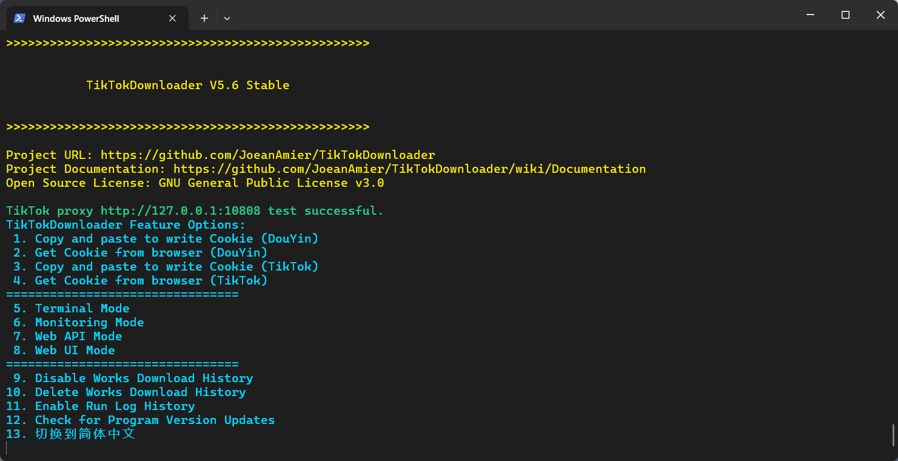
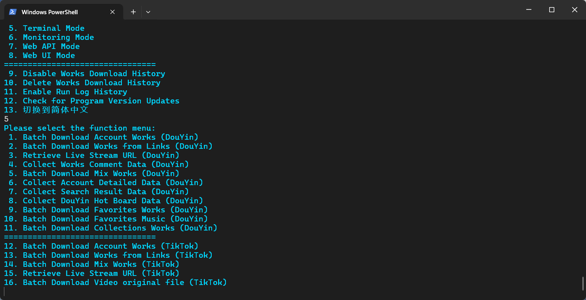
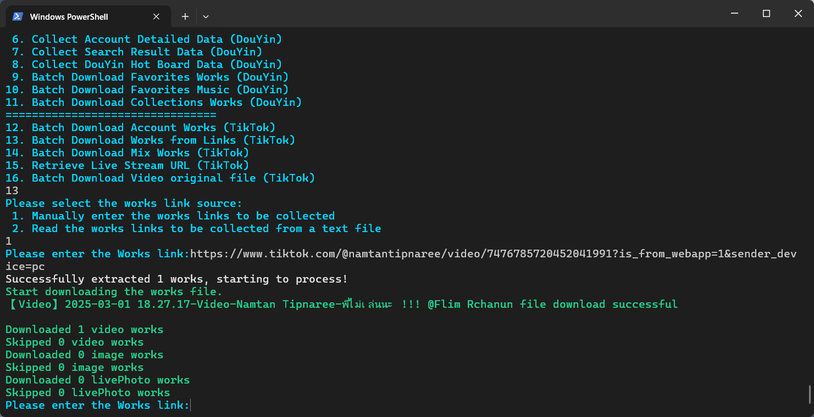
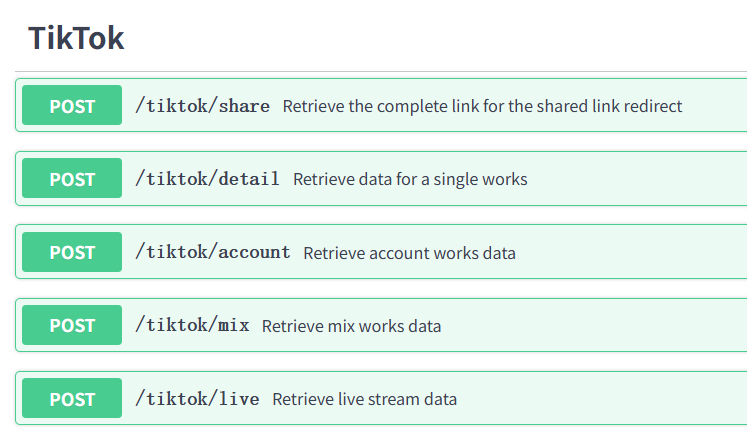
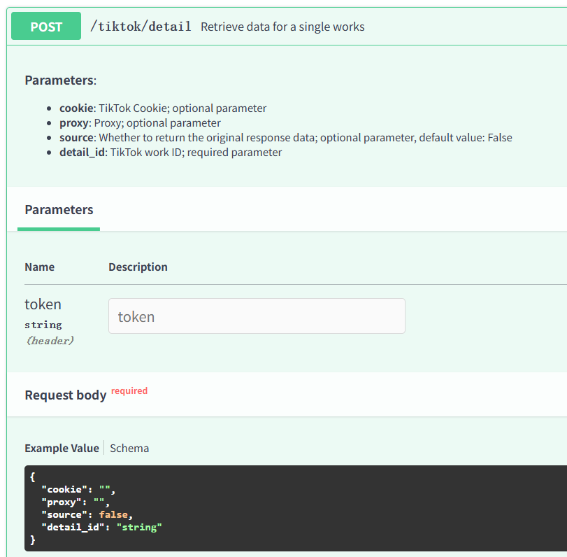
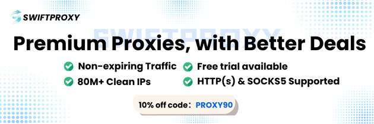

<div align="center">
<br>
<h1>DouK-Downloader</h1>
<p><a href="README.md">简体中文</a> | <a href="README_EN.md">English</a> | 日本語</p>
<a href="https://trendshift.io/repositories/6222" target="_blank"></a>
<br>


<br>


</div>
<br>
<p>🔥 <b>TikTok 投稿/いいね/ミックス/ライブ/動画/画像/音楽; DouYin（抖音）投稿/いいね/お気に入り/コレクション/動画/画像/ライブフォト/ライブ/音楽/ミックス/コメント/アカウント/検索/ホットボード データ取得ツール:</b> HTTPXモジュールをベースに実装された完全オープンソース・無料のデータ収集およびファイルダウンロードツール。DouYinアカウントの投稿作品、いいねした作品、お気に入り作品、コレクション作品の一括ダウンロード、TikTokアカウントの投稿作品といいねした作品の一括ダウンロード、DouYinリンクまたはTikTokリンクの作品ダウンロード、DouYinライブ配信のプッシュアドレス取得、DouYinライブ配信動画のダウンロード、TikTokライブ配信のプッシュアドレス取得、TikTokライブ配信動画のダウンロード、DouYin作品のコメントデータ収集、DouYinミックス作品の一括ダウンロード、TikTokミックス作品の一括ダウンロード、DouYinアカウントの詳細データ収集、DouYinのユーザー/作品/ライブ検索結果の収集、DouYinホットボードデータの収集に対応しています。</p>
<p>⭐ 以前のプロジェクト名: <code>TikTokDownloader</code></p>
<p>📣 本プロジェクトは今後コード構造のリファクタリングを予定しており、コードの堅牢性を高め、保守性と拡張性を向上させることを目標としています。プロジェクトの設計、実装方法、最適化のアイデアについてご意見がありましたら、ぜひご提案いただくか、ディスカッションにご参加ください！</p>
<hr>

# 📝 プロジェクトの特徴

<details>
<summary>機能一覧（クリックして展開）</summary>
<ul>
<li>✅ DouYinの動画/画像をダウンロード</li>
<li>✅ DouYinのライブフォトをダウンロード</li>
<li>✅ 最高画質の動画ファイルをダウンロード</li>
<li>✅ TikTokの動画ソースファイルをダウンロード</li>
<li>✅ TikTokの動画/画像をダウンロード</li>
<li>✅ DouYinアカウントの投稿/いいね/お気に入り作品をダウンロード</li>
<li>✅ TikTokアカウントの投稿/いいね作品をダウンロード</li>
<li>✅ DouYin/TikTokの詳細データを収集</li>
<li>✅ リンク作品の一括ダウンロード</li>
<li>✅ 複数アカウントの作品を一括ダウンロード</li>
<li>✅ ダウンロード済みファイルを自動スキップ</li>
<li>✅ 収集データの永続保存</li>
<li>✅ CSV/XLSX/SQLite形式でのデータ保存に対応</li>
<li>✅ 動的/静的カバー画像のダウンロード</li>
<li>✅ DouYinライブ配信のプッシュアドレスを取得</li>
<li>✅ TikTokライブ配信のプッシュアドレスを取得</li>
<li>✅ ffmpegを使用してライブ動画をダウンロード</li>
<li>✅ Web UIインタラクションインターフェース</li>
<li>✅ DouYin作品のコメントデータを収集</li>
<li>✅ DouYinミックス作品の一括ダウンロード</li>
<li>✅ TikTokミックス作品の一括ダウンロード</li>
<li>✅ いいね数やお気に入り数などの統計を記録</li>
<li>✅ 公開日時に基づいて作品をフィルタリング</li>
<li>✅ アカウント作品の増分ダウンロードに対応</li>
<li>✅ プロキシを使用したデータ収集に対応</li>
<li>✅ LANを介したリモートアクセスに対応</li>
<li>✅ DouYinアカウントの詳細データを収集</li>
<li>✅ 作品の統計情報を更新</li>
<li>✅ カスタムアカウント/ミックスマークに対応</li>
<li>✅ アカウントのニックネーム/マークを自動更新</li>
<li>✅ プライベートサーバーへのデプロイ</li>
<li>✅ パブリックサーバーへのデプロイ</li>
<li>✅ DouYin検索データの収集</li>
<li>✅ DouYinホットボードデータの収集</li>
<li>✅ ダウンロード済み作品のIDを記録</li>
<li>☑️ <del>QRコードスキャンでログインしてCookieを取得</del></li>
<li>✅ ブラウザからCookieを取得</li>
<li>✅ Web APIコールに対応</li>
<li>✅ マルチスレッドでの作品ダウンロードに対応</li>
<li>✅ ファイル整合性処理メカニズム</li>
<li>✅ 作品フィルタリングのカスタムルール</li>
<li>✅ フォルダ別に作品ファイルをアーカイブ保存</li>
<li>✅ ファイルサイズ制限のカスタマイズ</li>
<li>✅ ブレークポイントからのファイル再開ダウンロードに対応</li>
<li>✅ クリップボードのリンクを監視して作品をダウンロード</li>
</ul>
</details>

# 💻 プログラムのスクリーンショット

<p><a href="https://www.bilibili.com/video/BV1d7eAzTEFs/">Bilibiliでデモを見る</a>; <a href="https://youtu.be/yMU-RWl55hg">YouTubeでデモを見る</a></p>

## ターミナルインタラクションモード

<p>設定ファイルを通じてアカウントを管理することを推奨します。詳細については<a href="https://github.com/JoeanAmier/TikTokDownloader/wiki/Documentation">ドキュメント</a>を参照してください。</p>


*****

*****


## Web UIインタラクションモード

> **プロジェクトコードはリファクタリングされましたが、このモードのコードはまだ更新されていません。今後の開発完了後に再公開予定です！**

## Web APIモード


*****


> **このモードを起動後、http://127.0.0.1:5555/docs または http://127.0.0.1:5555/redoc を開いて自動生成されたドキュメントにアクセスしてください！**

### APIコール例

```python
from httpx import post
from rich import print


def demo():
    headers = {"token": ""}
    data = {
        "detail_id": "0123456789",
        "pages": 2,
    }
    api = "http://127.0.0.1:5555/douyin/comment"
    response = post(api, json=data, headers=headers)
    print(response.json())


demo()
```

# 📋 プロジェクト説明

## クイックスタート

<p>⭐ macOSおよびWindows 10以降のユーザーは、<a href="https://github.com/JoeanAmier/TikTokDownloader/releases/latest">Releases</a>または<a href="https://github.com/JoeanAmier/TikTokDownloader/actions">Actions</a>からコンパイル済みプログラムをダウンロードして、すぐに使用できます！</p>
<p>⭐ 本プロジェクトにはGitHub Actionsによる実行ファイルの自動ビルド機能が含まれています。ユーザーはいつでもGitHub Actionsを使用して最新のソースコードから実行ファイルをビルドできます！</p>
<p>⭐ 実行ファイルの自動ビルドチュートリアルについては、本ドキュメントの<code>実行ファイルのビルドガイド</code>セクションを参照してください。より詳細なステップバイステップのイラスト付きチュートリアルが必要な場合は、<a href="https://mp.weixin.qq.com/s/TorfoZKkf4-x8IBNLImNuw">こちらの記事をご覧ください</a>！</p>
<p><strong>注意：macOSプラットフォームの実行ファイル<code>main</code>はコード署名されていないため、初回実行時にシステムのセキュリティ制限を受けます。ターミナルで<code>xattr -cr プロジェクトフォルダパス</code>コマンドを実行してセキュリティフラグを削除すると、正常に実行できるようになります。</strong></p>
<hr>
<ol>
<li><b>実行ファイルを実行</b>するか、<b>環境を設定して実行</b>（どちらか一つを選択）
<ol><b>実行ファイルを実行</b>
<li><a href="https://github.com/JoeanAmier/TikTokDownloader/releases/latest">Releases</a>またはActionsでビルドされた実行ファイルの圧縮ファイルをダウンロードします。</li>
<li>解凍後、プログラムフォルダを開き、<code>main</code>をダブルクリックして実行します。</li>
</ol>
<ol><b>環境を設定して実行</b>

[//]: # (<li><code>3.12</code>以上のPythonインタープリターをインストール</li>)
<li><a href="https://www.python.org/">Python</a>インタープリター バージョン<code>3.12</code>をインストール</li>
<li>最新のソースコードまたは<a href="https://github.com/JoeanAmier/TikTokDownloader/releases/latest">Releases</a>で公開されているソースコードをローカルマシンにダウンロード</li>
<ol><b>pipを使用してプロジェクトの依存関係をインストール</b>
<li><code>python -m venv venv</code>コマンドを実行して仮想環境を作成（任意）</li>
<li><code>.\venv\Scripts\activate.ps1</code>または<code>venv\Scripts\activate</code>コマンドを実行して仮想環境を有効化（任意）</li>
<li><code>pip install -i https://pypi.tuna.tsinghua.edu.cn/simple -r requirements.txt</code>コマンドを実行してプログラムに必要なモジュールをインストール</li>
<li><code>python .\main.py</code>または<code>python main.py</code>コマンドを実行してDouK-Downloaderを起動</li>
</ol>
<ol><b>uvを使用してプロジェクトの依存関係をインストール（推奨）</b>
<li><code>uv sync --no-dev</code>コマンドを実行して環境の依存関係を同期</li>
<li><code>uv run main.py</code>コマンドを実行してDouK-Downloaderを起動</li>
</ol>
</ol>
</li>
<li>DouK-Downloaderの免責事項を読み、プロンプトに従って内容を入力します。</li>
<li>Cookie情報を設定ファイルに書き込み
<ol><b>クリップボードからCookieを読み取る（推奨）</b>
<li><a href="https://github.com/JoeanAmier/TikTokDownloader/blob/master/docs/Cookie%E8%8E%B7%E5%8F%96%E6%95%99%E7%A8%8B.md">Cookie取得チュートリアル</a>を参考に、必要なCookieをクリップボードにコピー</li>
<li><code>クリップボードからCookieを読み取る</code>オプションを選択すると、プログラムが自動的にクリップボードからCookieを読み取り、設定ファイルに書き込みます</li>
</ol>
<ol><b>ブラウザからCookieを読み取る</b>
<li><code>ブラウザからCookieを読み取る</code>オプションを選択し、プロンプトに従ってブラウザの種類または対応する番号を入力</li>
</ol>
<ol><b><del>QRコードログインでCookieを取得</del>（無効）</b>
<li><del><code>QRコードログインでCookieを取得</code>オプションを選択すると、プログラムがログイン用QRコード画像を表示し、デフォルトアプリケーションで開きます</del></li>
<li><del>TikTokアプリでQRコードをスキャンしてログイン</del></li>
<li><del>プロンプトに従うと、プログラムが自動的にCookieを設定ファイルに書き込みます</del></li>
</ol>
</li>
<li>プログラム画面に戻り、<code>ターミナルインタラクションモード</code> → <code>リンク作品の一括ダウンロード（汎用）</code> → <code>収集する作品のリンクを手動入力</code>の順に選択します。</li>
<li>DouYin作品のリンクを入力して作品ファイルをダウンロードします（TikTokプラットフォームではより多くの初期設定が必要です。詳細はドキュメントを参照してください）。</li>
<li>より詳しい説明については、<b><a href="https://github.com/JoeanAmier/TikTokDownloader/wiki/Documentation">プロジェクトドキュメント</a></b>をご覧ください。</li>
</ol>
<p>⭐ <a href="https://learn.microsoft.com/zh-cn/windows/terminal/install">Windows Terminal</a>（Windows 11に標準搭載のターミナル）の使用を推奨します。</p>

### Dockerコンテナ

<ol>
<li>イメージの取得</li>
<ul>
<li>方法1：<code>Dockerfile</code>を使用してイメージをビルドする。</li>
<li>方法2：<code>docker pull joeanamier/tiktok-downloader</code>コマンドでイメージをプルする。</li>
<li>方法3：<code>docker pull ghcr.io/joeanamier/tiktok-downloader</code>コマンドでイメージをプルする。</li>
</ul>
<li>コンテナの作成：<code>docker run --name コンテナ名(任意) -p ホストポート:5555 -v tiktok_downloader_volume:/app/Volume -it &lt;イメージ名&gt;</code></li>
<br><b>注意：</b>ここでの<code>&lt;イメージ名&gt;</code>は、最初のステップで使用したイメージ名（<code>joeanamier/tiktok-downloader</code>または<code>ghcr.io/joeanamier/tiktok-downloader</code>）と一致させる必要があります。
<li>コンテナの実行
<ul>
<li>コンテナの起動：<code>docker start -i コンテナ名/コンテナID</code></li>
<li>コンテナの再起動：<code>docker restart -i コンテナ名/コンテナID</code></li>
</ul>
</li>
</ol>
<p>Dockerコンテナはホストマシンのファイルシステムに直接アクセスできないため、一部の機能が利用できない場合があります。例：<code>ブラウザからCookieを取得</code>。その他の問題がある場合はご報告ください！</p>
<hr>

## Cookieについて

[クリックしてCookieチュートリアルを表示](https://github.com/JoeanAmier/TikTokDownloader/blob/master/docs/Cookie%E8%8E%B7%E5%8F%96%E6%95%99%E7%A8%8B.md)

> * Cookieは有効期限が切れた後にのみ設定ファイルに再書き込みが必要で、プログラムを実行するたびに行う必要はありません。
>
> * CookieはDouYinプラットフォームからダウンロードする動画ファイルの解像度に影響する場合があります。高解像度の動画ファイルをダウンロードできない場合は、Cookieの更新をお試しください！
>
> * プログラムがデータの取得に失敗した場合は、Cookieを更新するか、ログイン済みのCookieを使用してみてください！

<hr>

## その他の説明

<ul>
<li>本プロジェクトにはインテリジェント遅延リクエストメカニズムが組み込まれており、過度なリクエスト頻度によるプラットフォームサーバーへの影響を回避します。無効にする必要がある場合は、<a href="https://github.com/JoeanAmier/TikTokDownloader/wiki/Documentation#%E9%AB%98%E7%BA%A7%E9%85%8D%E7%BD%AE">ドキュメント</a>を参照してください。</li>
<li>プログラムがユーザーに入力を求める際、Enterキーを直接押すと前のメニューに戻り、<code>Q</code>または<code>q</code>を入力するとプログラムが終了します。</li>
<li>アカウントのいいね作品やお気に入り作品のデータ取得では、それらの作品の公開日のみが返され、アクション（いいねまたはお気に入り）の日付は返されないため、日付フィルタリングを行う前にすべてのいいね/お気に入り作品のデータを取得する必要があります。作品数が多い場合、かなりの時間がかかる場合があります。リクエスト数は<code>max_pages</code>パラメータで制御できます。</li>
<li>非公開アカウントの投稿データを取得するには、ログイン済みのCookieが必要で、ログインアカウントがその非公開アカウントをフォローしている必要があります。</li>
<li>アカウントの投稿作品やミックス作品を一括ダウンロードする際、対応するニックネームやマークパラメータが変更された場合、プログラムはダウンロード済み作品のファイル名のニックネームとマークパラメータを自動的に更新します。</li>
<li>ファイルのダウンロード時、プログラムはまず一時フォルダにダウンロードし、完了後に保存フォルダに移動します。一時フォルダはプログラム終了時にクリアされます。</li>
<li><code>お気に入り作品一括ダウンロードモード</code>は現在、現在ログイン中のCookieに対応するアカウントのお気に入り作品のダウンロードのみをサポートしており、複数アカウントには対応していません。</li>
<li>プログラムにプロキシを使用してデータをリクエストさせたい場合は、設定ファイル<code>settings.json</code>の<code>proxy</code>パラメータを設定してください（プロキシサービスの利用を検討：<a href="https://www.swiftproxy.net/?ref=TikTokDownloader">Swiftproxy</a>）</li>
<li>JSONファイルを編集する適切なプログラムがコンピュータにない場合は、<a href="https://www.toolhelper.cn/JSON/JSONFormat">オンラインツール</a>を使用して設定ファイルの内容を編集することをお勧めします。変更後、ソフトウェアを再起動する必要があります。</li>
<li>プログラムがユーザーに内容やリンクの入力を求める際、改行文字が含まれないように注意してください。予期しない問題が発生する可能性があります。</li>
<li>本プロジェクトは有料作品のダウンロードをサポートしていません。有料作品のダウンロードに関する問題を報告しないでください。</li>
<li>Windowsシステムでは、Chromium、Chrome、Edgeブラウザからクッキーを読み取るために、管理者としてプログラムを実行する必要があります。</li>
<li>本プロジェクトはプログラムの複数インスタンス実行に最適化されていません。複数インスタンスを実行する必要がある場合は、予期しない問題を避けるためにプロジェクトフォルダ全体をコピーしてください。</li>
<li>プログラム実行中にプログラムまたは<code>ffmpeg</code>を終了する必要がある場合は、<code>Ctrl + C</code>を押してプロセスを停止してください。ターミナルウィンドウの閉じるボタンを直接クリックしないでください。</li>
</ul>
<h2>実行ファイルのビルドガイド</h2>
<details>
<summary>実行ファイルのビルドガイド（クリックして展開）</summary>

このガイドでは、このリポジトリをフォークし、GitHub Actionsを実行して最新のソースコードに基づいてプログラムを自動ビルド・パッケージ化する方法を説明します！

---

### 使用手順

#### 1. リポジトリをフォーク

1. プロジェクトリポジトリの右上にある **Fork** ボタンをクリックして、個人のGitHubアカウントにフォークします
2. フォークしたリポジトリのアドレスは次のようになります：`https://github.com/あなたのユーザー名/このリポ`

---

#### 2. GitHub Actionsを有効化

1. フォークしたリポジトリのページに移動します
2. 上部の **Settings** タブをクリックします
3. 右側の **Actions** タブをクリックします
4. **General** オプションをクリックします
5. **Actions permissions** の下で、**Allow all actions and reusable workflows** を選択し、**Save** ボタンをクリックします

---

#### 3. ビルドプロセスを手動でトリガー

1. フォークしたリポジトリで、上部の **Actions** タブをクリックします
2. **構建可执行文件** という名前のワークフローを見つけます
3. 右側の **Run workflow** ボタンをクリックします：
    - **master** または **develop** ブランチを選択します
    - **Run workflow** をクリックします

---

#### 4. ビルドの進捗を確認

1. **Actions** ページで、トリガーされたワークフローの実行記録を確認できます
2. 実行記録をクリックして詳細なログを表示し、ビルドの進捗と状態を確認します

---

#### 5. ビルド結果をダウンロード

1. ビルドが完了したら、対応する実行記録ページに移動します
2. ページ下部の **Artifacts** セクションに、ビルドされた結果ファイルが表示されます
3. クリックしてダウンロードし、ローカルマシンに保存してビルドされたプログラムを取得します

---

### 注意事項

1. **リソース使用量**：
    - GitHubはActionsに無料のビルド環境を提供しており、無料ユーザーには月間使用制限（2000分）があります

2. **コードの変更**：
    - フォークしたリポジトリのコードを自由に変更してビルドプロセスをカスタマイズできます
    - 変更後、再度ビルドプロセスをトリガーしてカスタマイズ版を取得できます

3. **メインリポジトリとの同期**：
    - メインリポジトリに新しいコードやワークフローが更新された場合、最新の機能と修正を取得するためにフォークしたリポジトリを定期的に同期することをお勧めします

---

### よくある質問

#### Q1：ワークフローをトリガーできないのはなぜですか？

A：**Actionsの有効化**の手順に従っていることを確認してください。そうでないと、GitHubはワークフローの実行を禁止します。

#### Q2：ビルドプロセスが失敗した場合はどうすればよいですか？

A：

- 実行ログを確認して失敗の原因を把握してください
- コードに構文エラーや依存関係の問題がないことを確認してください
- 問題が解決しない場合は、[Issuesページ](https://github.com/JoeanAmier/TikTokDownloader/issues)でIssueを作成してください

#### Q3：メインリポジトリのActionsを直接使用できますか？

A：権限の制限により、メインリポジトリのActionsを直接トリガーすることはできません。フォークしたリポジトリを使用してビルドプロセスを実行してください。

</details>

## プログラムの更新

<p><strong>方法1：</strong>ファイルをダウンロードして解凍し、旧バージョンの<code>_internal\Volume</code>フォルダを新バージョンの<code>_internal</code>フォルダにコピーします。</p>
<p><strong>方法2：</strong>ファイルをダウンロードして解凍し（プログラムは実行しない）、すべてのファイルをコピーして旧バージョンに直接上書きします。</p>

# ⚠️ 免責事項

<ol>
<li>ユーザーによる本プロジェクトの使用は、完全にユーザー自身の裁量と責任で行われます。作者は、ユーザーが本プロジェクトを使用することにより生じるいかなる損失、請求、またはリスクについても一切の責任を負いません。</li>
<li>本プロジェクトの作者が提供するコードおよび機能は、現在の知識と技術的発展に基づいています。作者は既存の技術的能力に基づいてコードの正確性とセキュリティを確保するよう努めますが、コードに全くエラーや欠陥がないことを保証するものではありません。</li>
<li>本プロジェクトが依存するすべてのサードパーティライブラリ、プラグイン、またはサービスは、それぞれのオープンソースまたは商用ライセンスに従います。ユーザーはそれらのライセンス契約を確認し、遵守する必要があります。作者は、サードパーティコンポーネントの安定性、セキュリティ、またはコンプライアンスについて一切の責任を負いません。</li>
<li>ユーザーは本プロジェクトを使用する際、<a href="https://github.com/JoeanAmier/TikTokDownloader/blob/master/LICENSE">GNU General Public License v3.0</a>の要件を厳守し、コードが<a href="https://github.com/JoeanAmier/TikTokDownloader/blob/master/LICENSE">GNU General Public License v3.0</a>の下で使用されたことを適切に表示する必要があります。</li>
<li>本プロジェクトのコードおよび機能を使用する際、ユーザーは関連する法律や規制を独自に調査し、自身の行為が合法であり、法令を遵守していることを確認する必要があります。法律や規制の違反により生じるいかなる法的責任やリスクも、ユーザーのみが負うものとします。</li>
<li>ユーザーは、知的財産権を侵害する活動を行うためにこのツールを使用してはなりません。これには、許可なく著作権で保護されたコンテンツをダウンロードまたは配布することが含まれますが、これに限りません。開発者は、違法コンテンツの不正な取得または配布に参加、支持、または承認するものではありません。</li>
<li>本プロジェクトは、ユーザーが行ういかなるデータ処理活動（収集、保存、送信を含む）のコンプライアンスについても一切の責任を負いません。ユーザーは関連する法律や規制を遵守し、処理活動が合法かつ適切であることを確認する必要があります。非準拠の操作から生じる法的責任はユーザーが負うものとします。</li>
<li>いかなる状況においても、ユーザーは本プロジェクトの作者、貢献者、またはその他の関連当事者を自身のプロジェクト使用と関連付けることはできず、また、そのような使用から生じるいかなる損失や損害についてもこれらの当事者に責任を負わせることはできません。</li>
<li>本プロジェクトの作者は、DouK-Downloaderプロジェクトの有料版を提供せず、DouK-Downloaderプロジェクトに関連するいかなる商用サービスも提供しません。</li>
<li>本プロジェクトに基づく二次開発、修正、またはコンパイルは、原作者とは無関係です。原作者は、そのような二次開発から生じるいかなる結果についても一切の責任を負いません。ユーザーは、そのような変更から生じるすべての結果について完全な責任を負います。</li>
<li>本プロジェクトは特許ライセンスを付与しません。本プロジェクトの使用が特許紛争または侵害につながる場合、ユーザーはすべての関連するリスクと責任を負います。作者または権利者の書面による許可なく、ユーザーは本プロジェクトをいかなる商業的宣伝、マーケティング、または再ライセンスにも使用することはできません。</li>
<li>作者は、本免責事項に違反するいかなるユーザーに対しても、いつでもサービスを終了する権利を留保し、取得したすべてのコードおよび派生物の破棄を要求することができます。</li>
<li>作者は、事前の通知なくいつでも本免責事項を更新する権利を留保します。プロジェクトの継続的な使用は、改訂された条項への同意とみなされます。</li>
</ol>
<b>本プロジェクトのコードおよび機能を使用する前に、上記の免責事項を慎重に検討し、同意してください。ご質問がある場合、または声明に同意しない場合は、本プロジェクトのコードおよび機能を使用しないでください。本プロジェクトのコードおよび機能を使用した場合、上記の免責事項を完全に理解し同意したものとみなされ、本プロジェクトの使用に関連するすべてのリスクと結果を自発的に引き受けるものとします。</b>
<h1>🌟 コントリビューションガイドライン</h1>
<p><strong>本プロジェクトへのコントリビューションを歓迎します！コードベースをクリーンで効率的、かつメンテナンスしやすい状態に保つために、以下のガイドラインをよく読み、あなたのコントリビューションがスムーズに受け入れられ、統合されるようにしてください。</strong></p>
<ul>
<li>開発を始める前に、<code>develop</code>ブランチから最新のコードをプルして修正の基盤としてください。これにより、マージの競合を避け、変更がプロジェクトの最新状態に基づいていることが保証されます。</li>
<li>変更が複数の無関係な機能や問題に関わる場合は、それらを複数の独立したコミットまたはプルリクエストに分割してください。</li>
<li>各プルリクエストは可能な限り単一の機能や修正に焦点を当て、コードレビューとテストを容易にしてください。</li>
<li>既存のコーディングスタイルに従ってください。コードがプロジェクトに既にあるスタイルと一致していることを確認してください。Ruffツールを使用してコードフォーマットの標準を維持してください。</li>
<li>読みやすいコードを書いてください。他の人があなたの意図を理解しやすいよう、適切なコメントを追加してください。</li>
<li>各コミットには、変更内容を説明する明確で簡潔なコミットメッセージを含めてください。コミットメッセージは次の形式に従ってください：<code>&lt;type&gt;: &lt;short description&gt;</code></li>
<li>プルリクエストを提出する準備ができたら、<code>develop</code>ブランチへの提出を優先してください。これにより、メンテナーが<code>master</code>ブランチへの最終マージ前に追加のテストとレビューを行うためのバッファゾーンが提供されます。</li>
<li>開発を始める前や質問がある場合は、作者と事前にコミュニケーションを取り、方向性の一致を確認して、冗長な作業や不要なコミットを避けることをお勧めします。</li>
</ul>
<p><strong>参考資料：</strong></p>
<ul>
<li><a href="https://www.contributor-covenant.org/version/2/1/code_of_conduct/">Contributor Covenant</a></li>
<li><a href="https://opensource.guide/how-to-contribute/">How to Contribute to Open Source</a></li>
</ul>

# ♥️ プロジェクトを応援

<p><b>DouK-Downloader</b>がお役に立ちましたら、ぜひ<b>Star</b> ⭐をお願いします。皆様の応援に心より感謝します！</p>
<table>
<thead>
<tr>
<th align="center">微信(WeChat)</th>
<th align="center">支付宝(Alipay)</th>
</tr>
</thead>
<tbody><tr>
<td align="center"></td>
<td align="center"></td>
</tr>
</tbody>
</table>
<p>もしよろしければ、<b>DouK-Downloader</b>への追加サポートとしてご寄付をご検討ください！</p>

# 💰 プロジェクトスポンサー

## DartNode

[](https://dartnode.com "Powered by DartNode - Free VPS for Open Source")

***

## ZMTO

<p><a href="https://www.zmto.com/"></a></p>
<p><a href="https://www.zmto.com/">ZMTO</a>：信頼性の高い技術と専門的なサポートにより、洗練されたソリューションを提供するプロフェッショナルなクラウドインフラプロバイダーです。また、資格のあるオープンソースイニシアチブにエンタープライズグレードのVPSインフラを提供し、オープンソースエコシステムの持続可能な開発とイノベーションを推進しています。</p>

***

## Swiftproxy

<p><a href="https://www.swiftproxy.net/?ref=TikTokDownloader"></a></p>
<p>TikTokとDouYinのデータ抽出に最適化された8000万以上のレジデンシャルIPのグローバルプールにアクセスできます。<a href="https://www.swiftproxy.net/?ref=TikTokDownloader">Swiftproxy</a>はレート制限の回避、ブロックの削減、シームレスなIPローテーションによる安定したダウンロードを支援します。</p>

***

## TikHub

<p><a href="https://tikhub.io/?utm_source=github&utm_medium=readme&utm_campaign=tiktok_downloader&ref=github_joeanamier_tiktokdownloader"></a></p>
<p><a href="https://tikhub.io/?utm_source=github&utm_medium=readme&utm_campaign=tiktok_downloader&ref=github_joeanamier_tiktokdownloader">TikHub API</a>は、14以上のソーシャルメディアプラットフォームから動画、ユーザー、コメント、ストア、商品、トレンドなどのデータを取得・分析するための700以上のエンドポイントを提供し、すべてのデータへのワンストップアクセスと分析を可能にします。</p>
<p><strong>招待コード</strong>：<code>ZrdH8McC</code>を使用して登録・チャージすると、<code>$2</code>のクレジットがもらえます。</p>

# ✉️ 作者への連絡

<ul>
<li>作者のメール：yonglelolu@foxmail.com</li>
<li>作者のWeChat：Downloader_Tools</li>
<li>公式WeChatアカウント：Downloader Tools</li>
<li><b>Discordコミュニティ</b>：<a href="https://discord.com/invite/ZYtmgKud9Y">クリックしてコミュニティに参加</a></li>
</ul>
<p>✨ <b>作者の他のオープンソースプロジェクト：</b></p>
<ul>
<li><b>XHS-Downloader（小紅書、XiaoHongShu、RedNote）</b>：<a href="https://github.com/JoeanAmier/XHS-Downloader">https://github.com/JoeanAmier/XHS-Downloader</a></li>
<li><b>KS-Downloader（快手、KuaiShou）</b>：<a href="https://github.com/JoeanAmier/KS-Downloader">https://github.com/JoeanAmier/KS-Downloader</a></li>
</ul>
<h1>⭐ Star履歴</h1>
<p>

</p>

# 💡 プロジェクト参考

* https://github.com/Johnserf-Seed/f2
* https://github.com/Evil0ctal/Douyin_TikTok_Download_API
* https://github.com/justbeluga/tiktok-web-reverse-engineering
* https://github.com/ihmily/DouyinLiveRecorder
* https://github.com/encode/httpx/
* https://github.com/Textualize/rich
* https://github.com/omnilib/aiosqlite
* https://github.com/Tinche/aiofiles
* https://github.com/pyinstaller/pyinstaller
* https://foss.heptapod.net/openpyxl/openpyxl
* https://github.com/carpedm20/emoji/
* https://github.com/lxml/lxml
* https://ffmpeg.org/ffmpeg-all.html
