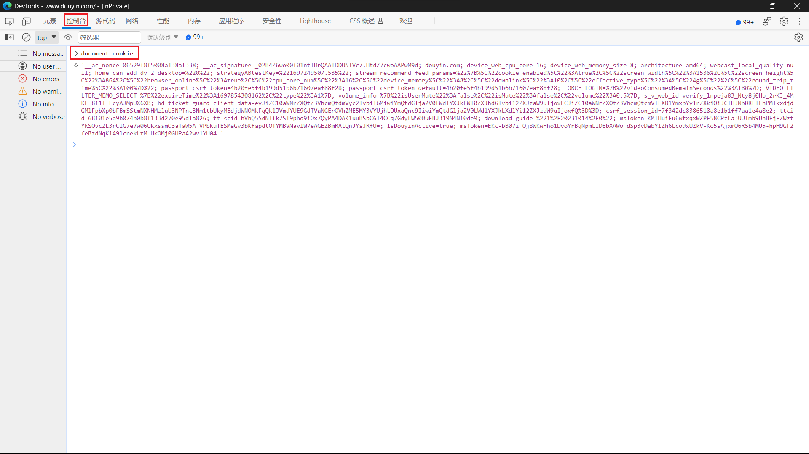

# Cookie 提取教程

本教程仅演示部分能够提取 `Cookie` 的方法，仍有其他方法能够提取 `Cookie`；本教程使用的浏览器为 `Microsoft Edge`
，部分浏览器的开发人员工具可能不支持中文语言。

**方法一\(推荐\)：**

1. 打开浏览器\(可选无痕模式启动\)，访问`https://www.douyin.com/`
2. 登录抖音账号\(可跳过\)
3. 按 `F12` 打开开发人员工具
4. 选择 `网络` 选项卡
5. 勾选 `保留日志`
6. 在 `筛选器` 输入框输入 `?device`
7. 点击 `抖音网页版` 左侧选项卡中 `直播`、`首页`、`推荐`、`关注` 等任意一个模块
8. 在开发人员工具窗口选择任意一个数据包
9. 依次查找 `标头` -> `请求标头` -> `Cookie`
10. 检查 `Cookie` 是否包含 `passport_csrf_token` 和 `odin_tt` 字段
11. 如果未包含所需字段，尝试刷新网页或者再次点击其他选项卡
12. 全选并复制 `Cookie` 的值
13. 运行 `main.py` ，写入 `Cookie`

**截图示例：**

**方法二\(不适用\)：**

1. 打开浏览器\(可选无痕模式启动\)，访问`https://www.douyin.com/`
2. 登录抖音账号\(可跳过\)
3. 按 `F12` 打开开发人员工具
4. 选择 `控制台` 选项卡
5. 输入 `document.cookie` 后回车确认
6. 检查 `Cookie` 是否包含 `passport_csrf_token` 和 `odin_tt` 字段
7. 如果未包含所需字段，尝试刷新网页或者再次点击左侧选项卡更新页面，回到第 5 步
8. 全选并复制 `Cookie` 的值
9. 运行 `main.py` ，写入 `Cookie`

**截图示例：**

