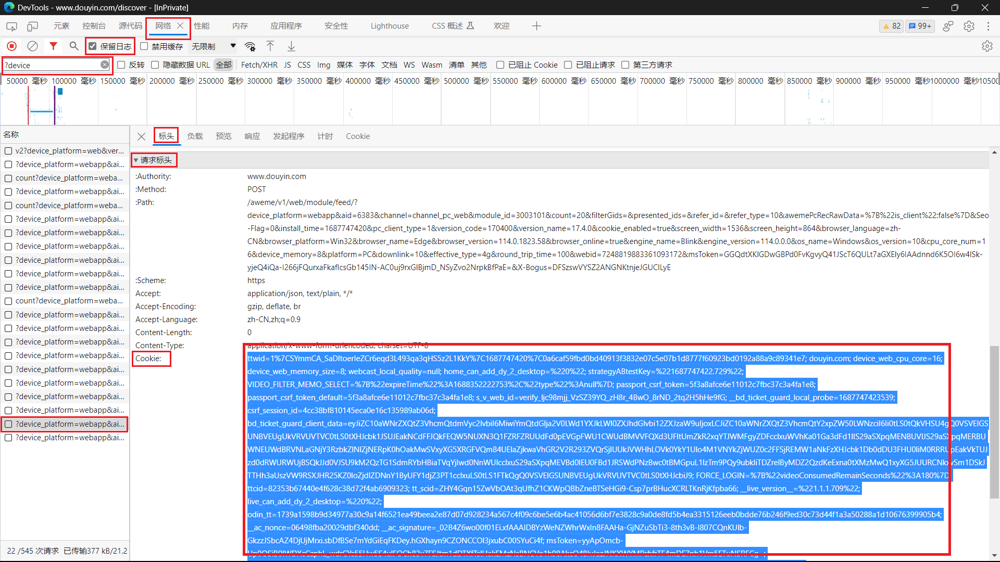

# Cookie 获取教程

本教程仅演示其中一种获取`Cookie`的方法，仍有其他方法能够获取`Cookie`；本教程使用的浏览器为 `Microsoft Edge`
，部分浏览器的开发人员工具可能无中文语言。

**大致步骤：**

1. 打开浏览器(可选无痕模式启动)，访问`https://www.douyin.com/`
2. 按`F12`打开开发人员工具
3. 选择`网络`选项卡
4. 勾选`保留日志`
5. 在`筛选器`输入框输入`?device`
6. 点击`抖音网页版`的`直播`页面
7. 在开发人员工具选择最新的数据包
8. 依次查找`标头`->`请求标头`->`Cookie`
9. 检查`Cookie`是否包含`passport_csrf_token`和`odin_tt`字段
10. 如果未包含所需字段，尝试刷新网页或者重新点击直播页面
11. 全选并复制`Cookie`的值
12. 打开`main.py`，写入`Cookie`

**结果示例：**

